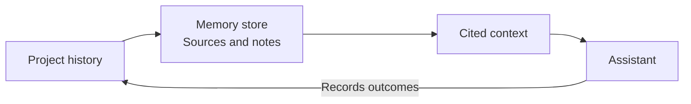

# Visp Memory

**Project memory for coding assistants.** Keep decisions, warnings, and useful
history across sessions. Retrieve relevant context with source citations, inspect
why it matched, and maintain the store from a local dashboard.

SQLite and keyword search work without a model or an external database.
An [optional Neo4j backend](docs/deployment/PACKAGING.md#neo4j-beta) is available
as an opt-in beta.



Your assistant owns execution and completion decisions. Memory supplies context;
it does not grant permission or certify that work is finished.

## Start with the dashboard

Run the published Linux amd64 image with persistent storage:

```bash
docker run -d --name visp-memory \
  -p 127.0.0.1:8000:8000 \
  -v visp-memory-data:/data \
  -e VISP_MEMORY_EMBEDDING_PROVIDER=noop \
  ghcr.io/djkeshawa/visp-memory:0.7.0
docker logs visp-memory
```

Open [the dashboard](http://127.0.0.1:8000/dashboard). On a fresh store, use the
one-use setup link in the logs to create your administrator account. There is no
shared default password. See [installation](docs/deployment/PACKAGING.md) for
Compose, upgrades, Python, and standalone downloads.

## Use it from your project

Requires Python 3.10+. Run these commands in your repository:

```bash
pip install "visp-memory[mcp,capture]"
visp-memory init
visp-memory decision "Use SQLite locally" "No database service needed"
visp-memory recall "local database"
visp-memory brief "implement local storage"
```

`init` creates project configuration and imports selected Git history. Connect
your assistant separately using the [MCP and hooks guide](docs/development/MCP.md).
Use `visp-memory doctor` to inspect configuration and integration problems.

## What you can do

- **Recall project knowledge:** search decisions and history, or prepare a cited task brief.
- **Understand results:** inspect matching words, retrieval method, sources, and quality flags.
- **Maintain memories:** preview [dreaming cycles](docs/development/DREAMING.md), schedule exact-duplicate cleanup, and review related or expired notes. Applied changes can be undone.
- **Follow task progress:** receive explicit [completion reports](docs/development/WORKFLOW_REPORTS.md) from your assistant or workflow, with evidence and history.
- **Keep control of data:** use local storage, scoped access, and [backup and restore](docs/development/STORAGE.md#backup-and-schema-upgrades).

The supported path is one developer working in one local repository. Dashboard/API
and some integrations are still early; team and graph features are frozen. Check
[feature status](docs/FEATURE_STATUS.md) for the limits of each surface.

## Documentation

Start with the [documentation index](docs/README.md), or go directly to:

| Learn | Configure | Integrate |
|---|---|---|
| [Architecture and data flow](docs/development/ARCHITECTURE.md) | [Installation](docs/deployment/PACKAGING.md) | [MCP and hooks](docs/development/MCP.md) |
| [Trust and privacy](docs/TRUST.md) | [Accounts and tokens](docs/deployment/AUTH.md) | [Workflow reports](docs/development/WORKFLOW_REPORTS.md) |
| [Dreaming](docs/development/DREAMING.md) | [Storage and embeddings](docs/development/STORAGE.md) | [Machine contracts](docs/development/CONTRACT_SURFACE.md) |

## Evidence and limits

[Benchmarks](docs/BENCHMARK.md) describe deterministic selection and poisoning
fixtures, including missed memories and other negative results. They do not
establish better coding outcomes or superiority over another memory product.
Published selection figures are checked against measured output by
[tests/docs/test_published_figures.py](tests/docs/test_published_figures.py).

## Contribute and license

See [Contributing](CONTRIBUTING.md) for development and submission requirements.
Licensed under [Apache 2.0](LICENSE); contributions require a DCO sign-off and the
[Contributor License Agreement](CLA.md).
