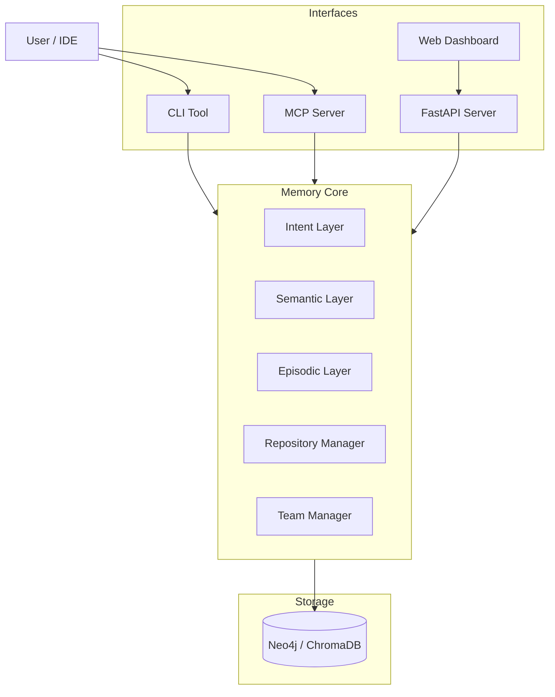

# Visp Memory

**Curated, auditable memory for coding agents.** Your assistant starts every session
knowing nothing about your project. This gives it the history — and, unusually, is
careful about how little it injects.

```bash
pip install visp-memory[mcp,capture]
cd your-project && visp-memory init          # mines your git history into memories
visp-memory recall "why do we use JWT"
```

`visp-memory init` reads your existing commit history, so the memory is useful in the
first minute rather than after weeks of manual note-taking.

## Why another memory system?

Most memory tools optimise for storing and injecting *more*. The evidence says that is
the wrong target. [SWE-ContextBench](https://arxiv.org/abs/2602.08316) (1,100 tasks, 51
repositories) found that well-chosen prior context lifts issue-resolution from 26.3% to
34.3% — but context the agent retrieved for *itself*, unfiltered, scored **12.1 points
below** the curated version and cost more tokens than using no memory at all.

So the hard part is not storage. It is choosing what not to say.

| | This project | Typical memory tools |
|---|---|---|
| Unit of memory | A codebase's decisions, warnings, and history | A user's chat preferences |
| Injection | Budgeted: a few high-scoring memories, or none | Everything that fits |
| Silent when unsure | Yes — abstains below a relevance floor | Rarely |
| Provenance | Every memory records where it came from | Usually absent |
| Poisoned/stale memory | Quarantined and decayed out of recall | Usually absent |
| Runs locally | Yes, SQLite by default | Often a hosted service |

**How it compares to your assistant's built-in memory:** Claude Code's auto memory and
`CLAUDE.md` are good, and this does not replace them. They are machine-local
([by design](https://code.claude.com/docs/en/memory)) and accumulate rather than curate.
This is portable across machines and tools, and it ranks, deduplicates, supersedes, and
budgets. See [docs/COMPARISON.md](docs/COMPARISON.md) for an honest side-by-side,
including where the alternatives win.

## Measured, not asserted

Every number below is recomputed in CI on each push *and compared against the figure
printed here* by `tests/docs/test_published_figures.py`, which fails if the two
disagree. A number that has drifted cannot survive a green build, so the figures on
this page are the ones the current code produces. See
[docs/BENCHMARK.md](docs/BENCHMARK.md) and [docs/TRUST.md](docs/TRUST.md) for the
methodology, the caveats, and the negative results.

| | Naive retrieval | This |
|---|---|---|
| Precision of injected memories | 0.09 | **1.00** |
| Mean tokens injected per task | 190.2 | **14.9** |
| Correct silence on unanswerable tasks | 20% | **100%** |
| Poisoned-memory retrieval ([MemoryGraft](https://arxiv.org/html/2512.16962v1) setup) | 56.25% | **0.00%** |

**What it costs:** recall is 0.625, not 1.00 — abstaining leaves 3 of the 8 genuinely
relevant memories on the floor, 37.5% of them.

**What it does not claim.** Every figure above comes from a small, authored corpus
run without a live model. They say the selection policy behaves as designed; they do
not say memory makes an agent's code better. No result in this repository does, and
**no controlled A/B of this package has been designed or run.** The one preregistered
A/B in the wider project has arms `bare` and `pack`: it measures the Visp Kit context
pack, not memory, and it never touches this package. It also stopped early — the model
access it needed was exhausted at 9 usable pairs of the 56 it preregistered — so **the
accuracy question is open and this package ships with it open.** Details in
[What is not measured](#what-is-not-measured).

Try it on your own repository without touching it:

```bash
./scripts/demo.sh /path/to/your/repo
```

**Status:** early. The single-developer local path is the supported one; team, graph,
and cross-repo features are frozen. See
[docs/FEATURE_STATUS.md](docs/FEATURE_STATUS.md).

## When this does not help

### Your agent cannot find this unless you tell it to

**`visp-memory init` writes nothing an agent will read.** It creates
`visp-memory.yaml` and a gitignored data directory — a config file and a database.
Neither one tells a coding agent that memory exists or names a single command to
run. A repository that has run `init` and nothing else looks, from inside an agent,
exactly like a repository where this package was never installed.

That is not hypothetical. In one recorded run an agent was told to use this package
on a project and to record and recall its decisions, and produced no memory activity
at all. It had not crashed and it had not been called: the string `visp-memory` did
not occur anywhere in the project tree it was working in — not in the instruction
file it was following, not in any prompt, not in any command it was handed. It was
obeying a workflow that never named memory, and nothing in the project contradicted
that workflow. **There was no way in, so no way in was found.**

The entry point is one command, and `doctor` will tell you whether you have one:

```bash
visp-memory doctor          # → Agent reachability: not reachable ...
visp-memory hooks install codex        # or claude-code, cursor, aider, generic
visp-memory doctor          # → Agent reachability: reachable - named in AGENTS.md
```

`init` reports the same line when it finishes, so the gap is visible at the moment
it is created. Until it says `reachable`, assume your agent will not use memory no
matter what you put in the prompt — an instruction file it is already following
outranks a request you make once.

### A first session on a brand-new project gets very little

`init` seeds memory by mining git history, so **the value it can deliver on day one
is bounded by how much history exists.** On a repository with two commits there are
two commits to mine. On a greenfield project there is no prior decision to recall,
because none has been made yet. If you are starting something new, this package has
close to nothing to tell you in the first hour, and the honest expectation is that
it starts paying on the second session and the second feature — the point where
"why did we do it that way" has an answer that is no longer in your head.

**What does work from the first minute is the write side.** Recording a decision and
recalling it back within the same session works on an empty store, and that is the
loop worth establishing early:

```bash
visp-memory decision "Screen wrap on all four edges" "Bouncing was rejected in the spec"
visp-memory brief "implement screen wrap"     # → the decision, cited
```

If nobody writes anything, nothing is recalled later. That is the actual failure
mode on new projects, and it is a workflow problem rather than a retrieval one.

### The rest of the honest list

- **It does not make an agent's code better, as far as anyone here has measured.**
  No controlled A/B of this package has been run. See
  [What is not measured](#what-is-not-measured).
- **Team, graph, and cross-repo features are frozen** — see
  [docs/FEATURE_STATUS.md](docs/FEATURE_STATUS.md).
- **It abstains rather than guess.** Recall is 0.625: it will stay silent on
  genuinely relevant memories rather than lower the bar. If you want everything
  that might match, this is the wrong tool.


---

## 📚 Documentation & Resources

| File | Description |
|------|-------------|
| [**docs/FEATURE_STATUS.md**](docs/FEATURE_STATUS.md) | What is stable, beta, experimental, or frozen |
| [**docs/COMPARISON.md**](docs/COMPARISON.md) | Honest comparison vs mem0, Zep, native assistant memory |
| [**docs/BENCHMARK.md**](docs/BENCHMARK.md) | Selection-quality results, including the negative ones |
| [**docs/TRUST.md**](docs/TRUST.md) | Provenance quarantine and poisoning resistance |
| [**docs/development/INJECTION_POLICY.md**](docs/development/INJECTION_POLICY.md) | Why recall injects so little, and the evidence for it |
| [**docs/ROADMAP.md**](docs/ROADMAP.md) | Project vision and future phases |
| [**docs/deployment/PACKAGING.md**](docs/deployment/PACKAGING.md) | Detailed distribution guide (Docker, Standalone, Pip) |
| [**docs/deployment/AUTH.md**](docs/deployment/AUTH.md) | Server auth modes, env vars, and deployment notes |
| [**docs/deployment/RELEASE_CHECKLIST.md**](docs/deployment/RELEASE_CHECKLIST.md) | Repeatable pre-release and post-release checks |
| [**docs/deployment/RELEASING.md**](docs/deployment/RELEASING.md) | How to create releases |
| [**docs/development/ARCHITECTURE.md**](docs/development/ARCHITECTURE.md) | System architecture and core components |
| [**docs/development/MCP.md**](docs/development/MCP.md) | MCP setup, tools, examples, and verification |
| [**docs/development/CONTRACT_SURFACE.md**](docs/development/CONTRACT_SURFACE.md) | The `contract` JSON surface for coordinators — and what is deliberately not on it |
| [**docs/development/TESTING.md**](docs/development/TESTING.md) | Testing practices and guidelines |
| [**docs/development/STORAGE.md**](docs/development/STORAGE.md) | Storage backends comparison and configuration |
| [**scripts/evaluate_agent_ab.py**](scripts/evaluate_agent_ab.py) | Deterministic A/B benchmark for memory-assisted agent behavior |

---

## The Problem

Every time an LLM starts a session, it has to re-learn your project from scratch: files, patterns, past decisions, and goals. This **"Context Amnesia"** leads to repetitive explanations and lost knowledge.

## The Solution

Visp Memory creates a persistent cognitive layer that mimics human memory:

1.  **Episodic Memory** ("What happened"): Events, bugs fixed, decisions made.
2.  **Semantic Memory** ("What we know"): Patterns, rules, and warnings extracted from experience.
3.  **Intent Memory** ("Where we're going"): Current goals and constraints.

By injecting this pre-formed context, your LLM (Claude, ChatGPT, etc.) instantly understands *why* the code is written this way and *what* you're trying to achieve.

---

## 🚀 Capabilities

| Interface | Status | Key Features |
|-----------|--------|--------------|
| **CLI** | Stable | `visp-memory init`, `recall`, `decision`, `warn`, `audit` |
| **MCP Server** | Stable | Memory tools for Claude Code / Cursor / any MCP client |
| **Assistant hooks** | Beta | Automatic, budgeted injection — no tool call required |
| **Dashboard + REST API** | Experimental | Graph visualization, intents, stats |

Team collaboration, cross-repo context, and the Neo4j/ArcadeDB graph backends are
implemented and tested but **frozen** while the single-developer path is the focus.
See [docs/FEATURE_STATUS.md](docs/FEATURE_STATUS.md) for the full matrix.

---

## 📦 Installation

Choose the method that fits your workflow.

### Method 1: Python Package (Recommended)

Install via pip. This includes the CLI, API server, and embedded dashboard. Add
`local-embeddings` when you want local sentence-transformer embeddings instead
of API/noop/fallback search.

```bash
# Lean server install: SQLite plus text fallback is the default
pip install visp-memory[api,mcp]

# Add ChromaDB only when persistent vector indexes are required
pip install visp-memory[api,mcp,chroma]

# Add local transformer/Torch support explicitly for non-production use
pip install visp-memory[api,mcp,local-embeddings]

# Local embedded graph backend without Docker/Neo4j
pip install "visp-memory[arcadedb,api,mcp]"

# From GitHub Release (direct download)
pip install https://github.com/djkeshawa/visp-memory/releases/download/v0.2.3/visp_memory_mcp-0.2.3-py3-none-any.whl

# From source (always available, no release required)
git clone https://github.com/djkeshawa/visp-memory.git
cd visp-memory && pip install -e ".[api,mcp,capture]"
```

The dashboard is bundled only in wheels built by the release workflow, which runs
`build_frontend.py` first. A wheel you build locally without that step ships the CLI,
API, and MCP server but no dashboard assets.

### Method 2: Docker

Run the API, dashboard, MCP-capable package, and storage with Docker Compose.
The `lite` profile uses SQLite and automatic embedding selection. The
`arcadedb` profile uses the embedded ArcadeDB graph backend in the app
container, with no separate database service. The `full` profile starts Neo4j
plus Ollama and pulls `nomic-embed-text`, so recall uses real semantic
embeddings out of the box.

```bash
# Quick local server + dashboard
docker compose --profile lite up --build

# Embedded local graph backend, no separate database service
docker compose --profile arcadedb up --build

# Full graph deployment with Neo4j included
docker compose --profile full up --build
```

Compose publishes API and database ports on `127.0.0.1` by default. Set a
unique `NEO4J_PASSWORD` for graph profiles and bootstrap the first dashboard
administrator with `VISP_MEMORY_BOOTSTRAP_ADMIN_USERNAME` and
`VISP_MEMORY_BOOTSTRAP_ADMIN_PASSWORD`. Sign in at `/dashboard/auth`, then use
the Integrations page to create scoped personal access tokens for API and MCP
clients. Set
`VISP_MEMORY_BIND_HOST=0.0.0.0` only when remote exposure is intentional and
protected by TLS and network controls.

Open `http://localhost:8000/dashboard`. Set `VISP_MEMORY_EMBEDDING_PROVIDER`
to `openai` with `OPENAI_API_KEY` when you prefer hosted embeddings; automatic
selection prefers OpenAI when a key is present, otherwise the full profile uses
Ollama. Local sentence-transformer embeddings are intentionally optional because
they make the image much larger:

```bash
VISP_MEMORY_EXTRAS=api,mcp,neo4j,local-embeddings \
VISP_MEMORY_EMBEDDING_PROVIDER=sentence-transformers \
docker compose --profile full up --build
```

The default Docker image includes ArcadeDB Embedded but excludes ChromaDB and
local transformer/Torch dependencies. Override extras only for a deliberate
custom image:

```bash
VISP_MEMORY_EXTRAS=api,mcp,neo4j,openai,ollama \
docker compose --profile lite up --build
```

### Method 3: Standalone Executable

Updates for non-Python users. Download the latest release for your platform (Linux/macOS/Windows).

1.  Download from [Releases](https://github.com/djkeshawa/visp-memory/releases)
2.  Extract the archive
3.  Run `./visp-memory`

For detailed build and distribution instructions, see [docs/deployment/PACKAGING.md](docs/deployment/PACKAGING.md).

### Uninstall

```bash
# Remove the package
pip uninstall visp-memory

# Optionally remove the project's memory store (created by `visp-memory init`)
rm -rf .visp-memory
```

---

## ⚙️ Configuration

### Prerequisites

| Dependency | Version | Required | Installation |
|------------|---------|----------|--------------|
| **Python** | 3.10+ | Yes | [python.org](https://www.python.org/downloads/) |
| **ArcadeDB Embedded** | 26.4.x | Optional local graph backend | `pip install "visp-memory[arcadedb,api,mcp]"` |
| **Neo4j** | 5.15+ | For team/graph deployments | See below |
| **Node.js** | 18+ | For dashboard dev | [nodejs.org](https://nodejs.org/) |

### Storage Backends

SQLite is the default because it has the smallest local install. ArcadeDB is the
local-first embedded graph option. Neo4j remains the mature external graph
backend for shared/team deployments.

| Backend | Set `VISP_MEMORY_STORAGE_BACKEND` | Install | Requires separate service | Best for |
|---------|----------------------------------|---------|---------------------------|----------|
| SQLite | `sqlite` or unset | `visp-memory[api,mcp]` | No | Smallest local install |
| ArcadeDB | `arcadedb` | `visp-memory[arcadedb,api,mcp]` | No | Local embedded graph storage |
| Neo4j | `neo4j` | `visp-memory[neo4j,api,mcp]` | Yes | Shared/team graph deployment |

ArcadeDB stores structured graph data under
`$VISP_MEMORY_STORAGE_DATA_DIR/arcadedb` and keeps vector behavior conservative
for v1 by using the existing Chroma/text fallback path rather than native
ArcadeDB vector indexes.

```bash
# SQLite default
visp-memory init --type code

# ArcadeDB local graph backend
export VISP_MEMORY_STORAGE_BACKEND=arcadedb
visp-memory init --type code
visp-memory serve

# Equivalent one-shot server start
VISP_MEMORY_STORAGE_BACKEND=arcadedb visp-memory serve
```

### Neo4j Setup

Visp Memory defaults to local SQLite storage so you can start without external
services. Neo4j is required only when you choose the graph storage backend for
team/shared deployments. Choose one option:

**Option 1: Docker (Recommended)**
```bash
docker run -d \
  --name neo4j \
  -p 7474:7474 -p 7687:7687 \
  -e NEO4J_AUTH=neo4j/your-password \
  -v neo4j-data:/data \
  neo4j:5
```

**Option 2: Neo4j Desktop**
1. Download from [neo4j.com/download](https://neo4j.com/download/)
2. Create a new project and local DBMS
3. Start the database

**Option 3: Neo4j AuraDB (Cloud)**
1. Sign up at [neo4j.com/cloud/aura](https://neo4j.com/cloud/aura/)
2. Create a free instance
3. Copy the connection URI

### Environment Variables

Set these before running Visp Memory:

```bash
export VISP_MEMORY_STORAGE_BACKEND="sqlite"
export NEO4J_URI="bolt://localhost:7687"
export NEO4J_USER="neo4j"
export NEO4J_PASSWORD="your-password"
```

| Variable | Description | Default |
|----------|-------------|---------|
| `VISP_MEMORY_STORAGE_BACKEND` | Storage backend: `sqlite`, `arcadedb`, or `neo4j` | `sqlite` |
| `VISP_MEMORY_STORAGE_DATA_DIR` | Local storage root for SQLite/ArcadeDB files | `.visp-memory/data` (per project) |
| `NEO4J_URI` | Neo4j connection URI | `bolt://localhost:7687` |
| `NEO4J_USER` | Neo4j username | `neo4j` |
| `NEO4J_PASSWORD` | Neo4j password | **Required** |
| `VISP_MEMORY_REPO_ID` | Default project scope | *None* |
| `VISP_MEMORY_EMBEDDING_PROVIDER` | Embedding provider: `auto`, `sentence-transformers`, `openai`, `ollama`, `noop` | `auto` |
| `VISP_MEMORY_API_KEY` | API key for server auth | *None* |
| `VISP_MEMORY_JWT_TOKEN` | JWT token for client mode | *None* |
| `VISP_MEMORY_JWT_SECRET` | Secret for JWT signing (server) | *None* |

---

## ⚡ Quick Start

### 1. Initialize

Initialize Visp Memory in your project root:

```bash
visp-memory init --type code
```

### 2. Give your agent a way in

`init` does not do this for you, and without it a coding agent has no way to learn
that memory exists — see
[Your agent cannot find this unless you tell it to](#your-agent-cannot-find-this-unless-you-tell-it-to).

```bash
visp-memory hooks list                 # the supported tools
visp-memory hooks install codex        # writes the instructions into AGENTS.md
visp-memory doctor                     # confirm: Agent reachability: reachable
```

### 3. Record Useful Memory

Start building your project's memory:

```bash
# Record a decision
visp-memory decision "Use JWT tokens" "Stateless scaling needed"

# Save a warning for specific files
visp-memory warn "src/auth.py" "Race condition possible - use mutex"

# Set a goal
visp-memory goal "Refactor Database Layer" --priority 2

# Search memories
visp-memory recall "authentication"
```

### 4. Start the Server & Dashboard

Launch the local server. The dashboard will be available at
`http://localhost:8000/dashboard`.

```bash
visp-memory serve
```

### 5. Give Context To An LLM

Generate a compact project context for pasting into an assistant:

```bash
visp-memory context
```

### 6. Estimate Token Footprint

Report two figures about your own store: consolidation deltas (how much smaller a
compressed semantic memory is than the episodic memories it replaced) and context
compactness (injected context versus the full active store):

```bash
visp-memory tokens
visp-memory tokens --format json
```

Both are **estimates against a hypothetical baseline**, not observed savings. Token
counts use `tiktoken` when it is installed and a chars/words heuristic otherwise, and
the compactness figure compares against injecting your entire store — which is not
something you would ever do. Read it as "how tight is the context I emit", not as
tokens you were billed and no longer are.

### Migrate Between Backends

Cross-backend graph portability is capability-gated. SQLite supports complete
export and atomic import; ArcadeDB supports complete export only. Remote/HTTP and
Neo4j currently support neither operation. Unsupported operations fail closed.

```bash
VISP_MEMORY_STORAGE_BACKEND=arcadedb visp-memory export memory.json
VISP_MEMORY_STORAGE_BACKEND=sqlite visp-memory import memory.json
```

---

## 🧪 Evaluate Agent Usefulness

Visp Memory includes deterministic evaluation scripts that check the retrieval
machinery end to end on fixed fixtures. They use isolated SQLite stores and noop
embeddings by default, so they need no network access and no API keys.

**Read the next number carefully.** These scripts measure the *mechanism* — does
the right memory reach the prompt, does the wrong one get refused, is the result
the same on every run. They do **not** measure whether an agent with memory writes
better code. Nothing in this repository measures that, and the one external
controlled study of the question found no code-quality improvement. Every rate
below is a property of a hand-built fixture; none of it is evidence about your
repository. See "What is not measured" below.

### Agent A/B Benchmark

Compare the same coding-agent tasks with memory disabled vs memory-grounded
context:

```bash
python3 scripts/evaluate_agent_ab.py
python3 scripts/evaluate_agent_ab.py --json
```

Example output:

```text
Agent memory A/B evaluation
Mode: deterministic_agent_proxy
Cases: 5

No memory:
  task_success_rate: 0%
  risky_action_rate: 100%

With memory:
  task_success_rate: 100%
  risky_action_rate: 0%
  citation_coverage_rate: 100%
  labelled_relevance_score: 100%

Risk reduction: 100% points (100% relative)
Token proxy delta: +25.4 mean words/case
Latency delta: +5.9 ms/case
```

The latency line is the only machine-dependent number here; the rest are
deterministic and identical on every run.

**What those rates are and are not.** The "no memory" arm is a scripted plan
written into the fixture, not an agent that was run. Its 0% success and 100% risky
actions are authored, chosen to represent an agent working without the relevant
warning — so the 100-point gap is the fixture's design, not a measurement of what
memory earns. What the run genuinely establishes is that the memory path is
*capable*: given a store that contains the guardrail, retrieval surfaces it, the
answer cites it, and the unanswerable case abstains rather than guessing — five
times out of five, reproducibly. Capability, not benefit.

### Grounding And Intelligence Checks

Run the companion evaluations for hallucination-risk reduction and graph/report
quality:

```bash
# Measures unsupported/false-answer reduction from memory grounding
python3 scripts/evaluate_hallucination.py --json

# Measures recall precision, evidence paths, stale intent surfacing, and report sections
python3 scripts/evaluate_memory_intelligence.py --json

# Measures storage/recall/import/export performance
python3 scripts/benchmark_memory.py --items 100 --json
python3 scripts/benchmark_memory.py --backend arcadedb --items 100 --json
```

### What is not measured

The honest boundary of everything above, stated once, plainly:

- **No live model has been run against these cases.** Every arm is a deterministic
  proxy over authored fixtures.
- **No powered A/B of *this package* exists — not run, not designed.** The wider
  project does have one paired, preregistered A/B with a stated effect-size bar, and
  it is frequently mistaken for evidence about memory. It is not: **its arms are
  `bare` and `pack`**, it measures the Visp Kit context pack, and memory is not an arm
  in it. It also stopped early — the model surface it depended on returned HTTP 403
  with the account's usage limit exhausted, so **9 of its 56 preregistered pairs came
  back usable** (152 cells were planned across the two arms and their repeat trials;
  23 reached a model), verdict `INCOMPLETE`. Nine perfectly concordant pairs resolve
  nothing, and are reported as resolving nothing. **The accuracy question for memory
  is open, not answered, and nothing yet built would have answered it.**
- **No result here is evidence about your repository.** The corpora are small,
  invented, and written by the same people who wrote the retrieval policy. Synthetic
  memories are cleaner and more distinguishable than a real project's history, which
  makes every selection score here an optimistic bound.
- **No code-quality benefit is claimed.** The one *external* controlled study of the
  underlying question found none. That the mechanism works is demonstrated; that it
  makes the code better is not, by anything in this repository.

That gap is deliberate to state rather than to imply. If you need the benefit
established before you depend on it, run the study below and treat this package as
unproven until you have.

For a live-agent study, reuse the same case set with your model runner: run each
task once without memory context and once after calling `visp-memory recall`, MCP
`memory_before_change`, or `/ai/ask`; then score task success, wrong edits avoided,
citation coverage, token use, and latency. Pair the runs, fix the analysis before
the first cell, and report the sample size you actually reached.

---

## ⚡ Automatic Memory Injection (Claude Code)

Beyond MCP tools (which the agent must *choose* to call), Visp Memory can install
**real Claude Code hooks** so memory is injected automatically:

```bash
visp-memory hooks install claude-code
```

This merges two hooks into your project's `.claude/settings.json`:

| Hook | When | What it injects |
|------|------|-----------------|
| `SessionStart` | A session begins | Compact project memory: goals, constraints, warnings, conventions |
| `PreToolUse` (Read/Edit/Write) | Before the agent reads or edits a file | That file's warnings, past bugs, and decisions |

Properties: fail-open (a memory failure never breaks your session), no
permission interference (context only, never a permission decision), and no
repeat spam (each file's context is injected once per session). Requires
`visp-memory` on PATH. Remove with `visp-memory hooks uninstall claude-code`, or
pass `--no-auto-inject` to skip hook installation.

### Seed Memory From Your Existing Instruction Files

Import the context you already maintain (CLAUDE.md, AGENTS.md, `.cursorrules`,
`.cursor/rules/*.mdc`, copilot-instructions.md) as relevance-ranked memories:

```bash
visp-memory ingest-instructions            # idempotent; re-run after edits
visp-memory ingest-instructions --dry-run  # preview
```

---

## 🤖 MCP Server (Claude Desktop / IDEs)

Visp Memory implements the **Model Context Protocol (MCP)**, allowing AI assistants to directly read and write to your project's memory.

### Configuration

Add to your `claude_desktop_config.json`:

```json
{
  "mcpServers": {
    "visp-memory": {
      "command": "visp-memory-mcp",
      "args": []
    }
  }
}
```

### Stateless HTTP Deployment

For a shared deployment — one server, many clients, no per-client process — run the
stateless streamable-HTTP transport:

```bash
visp-memory-mcp-http
```

Every `POST /mcp` is self-contained: no handshake first, no session id issued or
required, so any replica behind a load balancer can answer any request. Configure with
`VISP_MEMORY_MCP_HTTP_HOST` (default `127.0.0.1`), `VISP_MEMORY_MCP_HTTP_PORT`
(default `8848`), and `VISP_MEMORY_MCP_HTTP_TOKEN` (bearer token; **required** to bind
a non-loopback address — the server refuses to expose the write surface without it).

Two things differ from stdio: clients of a shared server should pass `repo_id`
explicitly (there is no per-client working directory to infer scope from), and
`memory_model_task` always uses the configured server-side provider (client sampling
needs a live session, which a stateless request never has).

### Available Tools
- `memory_prepare_task`: Build a cited, token-budgeted brief before planning or editing.
- `memory_recall`: Search past events and knowledge.
- `memory_record`: Save new findings or events.
- `memory_decision`: Document architectural choices.
- `memory_warn`: Flag fragile code areas.
- `memory_goal`: Manage project intent.
- `memory_file_context`: Get proactive context for specific files.
- `memory_session_start`: Start a Codex-style work session with project context.
- `memory_before_change`: Recall relevant warnings before editing files.
- `memory_after_work`: Record useful end-of-work memory.

### Tool Profiles (Token Efficiency)

Every advertised MCP tool definition costs context tokens in *every* session. Set
`VISP_MEMORY_MCP_PROFILE` to control how many tools are exposed:

| Profile | Tools | Advertised schema | Use when |
|---------|-------|-------------------|----------|
| `readonly` | 6 — retrieval and context only, no tool that writes | 5.3 KB | You want the assistant to read memory and never change it |
| `core` (default) | 17 — the everyday recall-before-work / record-after-work loop | 12.0 KB | Default; the leanest footprint that still closes the loop |
| `full` | All 36 | 19.9 KB | You want every advanced/maintenance tool advertised |

The `core` profile cuts the advertised tool-schema payload by about **39%** against
`full`. Hidden tools still work if a client calls them by name; the profile only
changes what is advertised.

Sizes are the serialised name, description, and input schema of every advertised
tool — exactly what an MCP client loads into context — measured by
`tests/interfaces/test_mcp_profile_footprint.py`, which fails if a profile drifts
away from the figures printed here. They are **not** quoted in tokens: tokenisation
is model-specific, this package ships no tokeniser, and the earlier "~1,250 fewer
tokens" in this table was an estimate nothing had checked. As a rough guide, divide
by three to four.

Prepare a task in one call:

```json
{
  "task": "Refactor login without breaking API clients",
  "files": ["src/auth.py"],
  "symbols": ["login"],
  "constraints": ["Preserve existing PAT scopes"],
  "token_budget": 1200
}
```

The response separates warnings, decisions, knowledge, and history; names active
intent and constraints; reports contradictions and unknowns; and cites every
memory. Send `previous_fingerprint` on the next call to receive an empty payload
when the brief has not changed. REST clients use `POST /context/brief` with the
same fields.

Task preparation uses hybrid associative retrieval: direct lexical/vector matches,
exact file and symbol links, and degree-normalized Personalized PageRank are combined
with reciprocal-rank fusion. Each evidence item includes `retrieval_channels` and
`retrieval_factors`, so clients can inspect whether it was found directly, through a
code entity, through the memory graph, or by multiple agreeing signals.

```json
{
  "mcpServers": {
    "visp-memory": {
      "command": "visp-memory-mcp",
      "args": [],
      "env": { "VISP_MEMORY_MCP_PROFILE": "core" }
    }
  }
}
```

### Codex Workflow

Install the Codex integration after the Docker/API server is running:

```bash
visp-memory hooks install codex \
  --server-url http://127.0.0.1:8000 \
  --repo-id visp-memory
```

This writes project-level `AGENTS.md` workflow guidance and a managed MCP block
in `~/.codex/config.toml`. Restart Codex after installing. In each session,
use memory recall before changing code and record decisions, bug fixes, release
notes, and fragile areas after work.

---

## 🌐 Workspace Scope & Multi-Project Usage

Visp Memory is designed to **share knowledge across your entire workspace by default**, enabling cross-project learning.

### Default: Unified Workspace
All memories are stored in a shared graph. Memories created in Project A are accessible in Project B if relevant.

### Project Isolation
For completely separate contexts (e.g., client work), use the `--repo` flag or configuration:

```bash
# Initialize with specific scope
visp-memory init --repo client-xyz

# Or per-command
visp-memory record "Secret stuff" --repo secret-project
```

### Multi-Project Dependencies

Track how projects relate to each other. Use either the CLI or the REST API.

**Via CLI:**

```bash
# Register repositories
visp-memory repos register my-app --desc "Main application"
visp-memory repos register shared-lib --desc "Internal utilities"

# Declare a dependency
visp-memory repos dependency my-app shared-lib --type depends_on

# List repositories (optionally scoped to a team)
visp-memory repos list

# Get cross-repo context (warnings + breaking changes pulled from dependencies)
visp-memory repos context my-app
```

**Via REST API:**

```bash
# Register repositories
curl -X POST http://localhost:8000/repos -d '{"name": "my-app", "id": "app"}' -H "X-API-Key: key"
curl -X POST http://localhost:8000/repos -d '{"name": "shared-lib", "id": "lib"}' -H "X-API-Key: key"

# Add dependency
curl -X POST http://localhost:8000/repos/app/dependencies -d '{"target_repo_id": "lib"}' -H "X-API-Key: key"

# Get cross-repo context (includes warnings from lib)
curl http://localhost:8000/repos/app/context -H "X-API-Key: key"
```

### Teams

Group users and attribute memories to a team. Useful for shared-server deployments.

```bash
# Create a team and a user, then add the user to the team
visp-memory teams create "Platform"
visp-memory teams user alice --email alice@example.com
visp-memory teams add-member platform alice
```

The same operations are exposed under `/teams/*` on the REST API.

---

## 🛠️ Development

If you want to contribute or modify the dashboard:

```bash
# Clone repository
git clone https://github.com/djkeshawa/visp-memory.git
cd visp-memory

# Install in editable mode
make install-dev

# Build everything
make build

# Run tests
make test
```

---

## 🧠 Architecture



---

## License

[Apache License 2.0](LICENSE).

Contributions are welcome — see [CONTRIBUTING.md](CONTRIBUTING.md). Contributors sign
off with the Developer Certificate of Origin, and a one-time
[Contributor License Agreement](CLA.md) is required before a pull request is merged.
