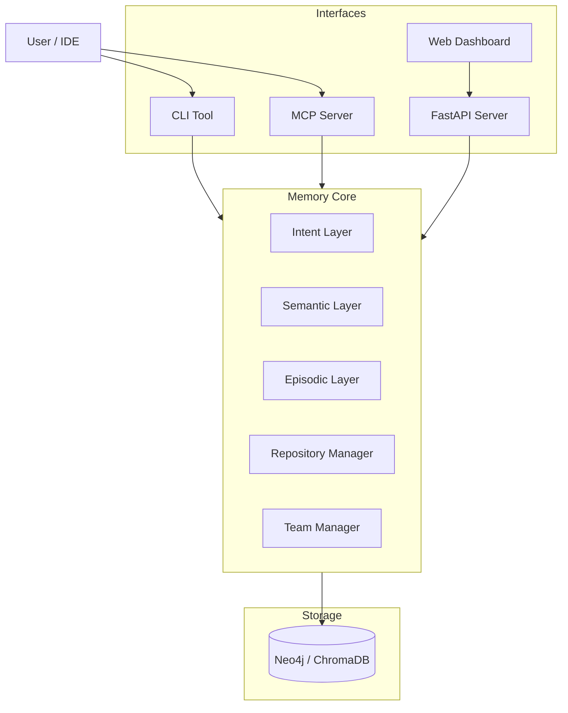

# LLM Memory

**Human-inspired memory system for LLMs** - persistent context, compressed knowledge, and intent tracking.

> **Vision**: A central, cross-functional memory that evolves with your team. Starting as a local tool for individuals, it will grow into a shared organizational brain that tracks context across multiple repositories.


---

## 📚 Documentation & Resources

| File | Description |
|------|-------------|
| [**docs/ROADMAP.md**](docs/ROADMAP.md) | Project vision and future phases |
| [**docs/deployment/PACKAGING.md**](docs/deployment/PACKAGING.md) | Detailed distribution guide (Docker, Standalone, Pip) |
| [**docs/deployment/AUTH.md**](docs/deployment/AUTH.md) | Server auth modes, env vars, and deployment notes |
| [**docs/deployment/RELEASE_CHECKLIST.md**](docs/deployment/RELEASE_CHECKLIST.md) | Repeatable pre-release and post-release checks |
| [**docs/deployment/RELEASING.md**](docs/deployment/RELEASING.md) | How to create releases |
| [**docs/development/ARCHITECTURE.md**](docs/development/ARCHITECTURE.md) | System architecture and core components |
| [**docs/development/MATURITY_PLAN.md**](docs/development/MATURITY_PLAN.md) | Path from developer preview to production candidate |
| [**docs/development/MCP.md**](docs/development/MCP.md) | MCP setup, tools, examples, and verification |
| [**docs/development/TESTING.md**](docs/development/TESTING.md) | Testing practices and guidelines |
| [**docs/development/STORAGE.md**](docs/development/STORAGE.md) | Storage backends comparison and configuration |

---

## The Problem

Every time an LLM starts a session, it has to re-learn your project from scratch: files, patterns, past decisions, and goals. This **"Context Amnesia"** leads to repetitive explanations and lost knowledge.

## The Solution

LLM Memory creates a persistent cognitive layer that mimics human memory:

1.  **Episodic Memory** ("What happened"): Events, bugs fixed, decisions made.
2.  **Semantic Memory** ("What we know"): Patterns, rules, and warnings extracted from experience.
3.  **Intent Memory** ("Where we're going"): Current goals and constraints.

By injecting this pre-formed context, your LLM (Claude, ChatGPT, etc.) instantly understands *why* the code is written this way and *what* you're trying to achieve.

---

## 🚀 Capabilities

| Interface | Description | Key Features |
|-----------|-------------|--------------|
| **CLI** | Command Line Tool | `llm-memory record`, `recall`, `decision`, `warn` |
| **MCP Server** | Model Context Protocol | Exposes memory tools directly to Claude/IDE |
| **Dashboard** | Web Interface | Graph visualization, intent management, stats |
| **API** | REST API | Full programmatic access with JWT/API key auth |

### 🆕 Phase 3 Features

| Feature | Description |
|---------|-------------|
| **Multi-Repo Support** | Isolate memories by project, track dependencies |
| **Team Collaboration** | User/team management, shared context |
| **Cross-Repo Context** | Aggregate knowledge from dependent projects |
| **JWT Authentication** | Secure API access with tokens |

---

## 📦 Installation

Choose the method that fits your workflow.

### Method 1: Python Package (Recommended)

Install via pip. This includes the CLI, API server, and embedded dashboard. Add
`local-embeddings` when you want local sentence-transformer embeddings instead
of API/noop/fallback search.

```bash
# From PyPI (when published)
pip install llm-memory[all]

# Lean local install without local embedding model dependencies
pip install llm-memory[api,mcp]

# From GitHub Release (direct download)
pip install https://github.com/djkeshawa/llm-memory/releases/download/v0.1.0/llm_memory-0.1.0-py3-none-any.whl
```

### Method 2: Docker

Run the full system in a container (ideal for servers/teams).

```bash
docker run -p 8000:8000 -v ~/.llm-memory:/data ghcr.io/djkeshawa/llm-memory:latest
```

### Method 3: Standalone Executable

Updates for non-Python users. Download the latest release for your platform (Linux/macOS/Windows).

1.  Download from [Releases](https://github.com/djkeshawa/llm-memory/releases)
2.  Extract the archive
3.  Run `./llm-memory`

For detailed build and distribution instructions, see [docs/deployment/PACKAGING.md](docs/deployment/PACKAGING.md).

### Uninstall

```bash
# Remove the package
pip uninstall llm-memory

# Optionally remove data directory
rm -rf ~/.llm-memory
```

---

## ⚙️ Configuration

### Prerequisites

| Dependency | Version | Required | Installation |
|------------|---------|----------|--------------|
| **Python** | 3.10+ | Yes | [python.org](https://www.python.org/downloads/) |
| **Neo4j** | 5.15+ | For team/graph deployments | See below |
| **Node.js** | 18+ | For dashboard dev | [nodejs.org](https://nodejs.org/) |

### Neo4j Setup

LLM Memory defaults to local SQLite storage so you can start without external
services. Neo4j is required only when you choose the graph storage backend for
team/shared deployments. Choose one option:

**Option 1: Docker (Recommended)**
```bash
docker run -d \
  --name neo4j \
  -p 7474:7474 -p 7687:7687 \
  -e NEO4J_AUTH=neo4j/your-password \
  -v neo4j-data:/data \
  neo4j:5
```

**Option 2: Neo4j Desktop**
1. Download from [neo4j.com/download](https://neo4j.com/download/)
2. Create a new project and local DBMS
3. Start the database

**Option 3: Neo4j AuraDB (Cloud)**
1. Sign up at [neo4j.com/cloud/aura](https://neo4j.com/cloud/aura/)
2. Create a free instance
3. Copy the connection URI

### Environment Variables

Set these before running LLM Memory:

```bash
export NEO4J_URI="bolt://localhost:7687"
export NEO4J_USER="neo4j"
export NEO4J_PASSWORD="your-password"
```

| Variable | Description | Default |
|----------|-------------|---------|
| `NEO4J_URI` | Neo4j connection URI | `bolt://localhost:7687` |
| `NEO4J_USER` | Neo4j username | `neo4j` |
| `NEO4J_PASSWORD` | Neo4j password | **Required** |
| `LLM_MEMORY_REPO_ID` | Default project scope | *None* |
| `LLM_MEMORY_EMBEDDING_PROVIDER` | Embedding provider: `sentence-transformers`, `openai`, `ollama`, `noop` | `sentence-transformers` |
| `LLM_MEMORY_API_KEY` | API key for server auth | *None* |
| `LLM_MEMORY_JWT_TOKEN` | JWT token for client mode | *None* |
| `LLM_MEMORY_JWT_SECRET` | Secret for JWT signing (server) | *None* |

---

## ⚡ Quick Start

### 1. Initialize

Initialize LLM Memory in your project root:

```bash
llm-memory init --type code
```

### 2. Record Useful Memory

Start building your project's memory:

```bash
# Record a decision
llm-memory decision "Use JWT tokens" "Stateless scaling needed"

# Save a warning for specific files
llm-memory warn "src/auth.py" "Race condition possible - use mutex"

# Set a goal
llm-memory goal "Refactor Database Layer" --priority 2

# Search memories
llm-memory recall "authentication"
```

### 3. Start the Server & Dashboard

Launch the local server. The dashboard will be available at
`http://localhost:8000/dashboard`.

```bash
llm-memory serve
```

### 4. Give Context To An LLM

Generate a compact project context for pasting into an assistant:

```bash
llm-memory context
```

---

## 🤖 MCP Server (Claude Desktop / IDEs)

LLM Memory implements the **Model Context Protocol (MCP)**, allowing AI assistants to directly read and write to your project's memory.

### Configuration

Add to your `claude_desktop_config.json`:

```json
{
  "mcpServers": {
    "llm-memory": {
      "command": "llm-memory-mcp",
      "args": []
    }
  }
}
```

### Available Tools
- `memory_recall`: Search past events and knowledge.
- `memory_record`: Save new findings or events.
- `memory_decision`: Document architectural choices.
- `memory_warn`: Flag fragile code areas.
- `memory_goal`: Manage project intent.
- `memory_file_context`: Get proactive context for specific files.

---

## 🌐 Workspace Scope & Multi-Project Usage

LLM Memory is designed to **share knowledge across your entire workspace by default**, enabling cross-project learning.

### Default: Unified Workspace
All memories are stored in a shared graph. Memories created in Project A are accessible in Project B if relevant.

### Project Isolation
For completely separate contexts (e.g., client work), use the `--repo` flag or configuration:

```bash
# Initialize with specific scope
llm-memory init --repo client-xyz

# Or per-command
llm-memory record "Secret stuff" --repo secret-project
```

### Multi-Project Dependencies

Track how projects relate to each other. Use either the CLI or the REST API.

**Via CLI:**

```bash
# Register repositories
llm-memory repos register my-app --desc "Main application"
llm-memory repos register shared-lib --desc "Internal utilities"

# Declare a dependency
llm-memory repos dependency my-app shared-lib --type depends_on

# List repositories (optionally scoped to a team)
llm-memory repos list

# Get cross-repo context (warnings + breaking changes pulled from dependencies)
llm-memory repos context my-app
```

**Via REST API:**

```bash
# Register repositories
curl -X POST http://localhost:8000/repos -d '{"name": "my-app", "id": "app"}' -H "X-API-Key: key"
curl -X POST http://localhost:8000/repos -d '{"name": "shared-lib", "id": "lib"}' -H "X-API-Key: key"

# Add dependency
curl -X POST http://localhost:8000/repos/app/dependencies -d '{"target_repo_id": "lib"}' -H "X-API-Key: key"

# Get cross-repo context (includes warnings from lib)
curl http://localhost:8000/repos/app/context -H "X-API-Key: key"
```

### Teams

Group users and attribute memories to a team. Useful for shared-server deployments.

```bash
# Create a team and a user, then add the user to the team
llm-memory teams create "Platform"
llm-memory teams user alice --email alice@example.com
llm-memory teams add-member platform alice
```

The same operations are exposed under `/teams/*` on the REST API.

---

## 🛠️ Development

If you want to contribute or modify the dashboard:

```bash
# Clone repository
git clone https://github.com/djkeshawa/llm-memory.git
cd llm-memory

# Install in editable mode
make install-dev

# Build everything
make build

# Run tests
make test
```

---

## 🧠 Architecture



---

## License

MIT
