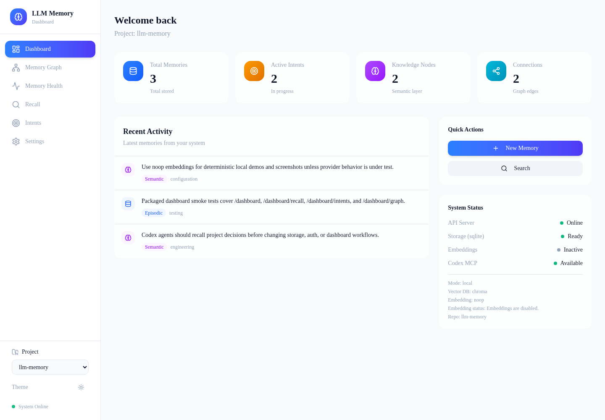
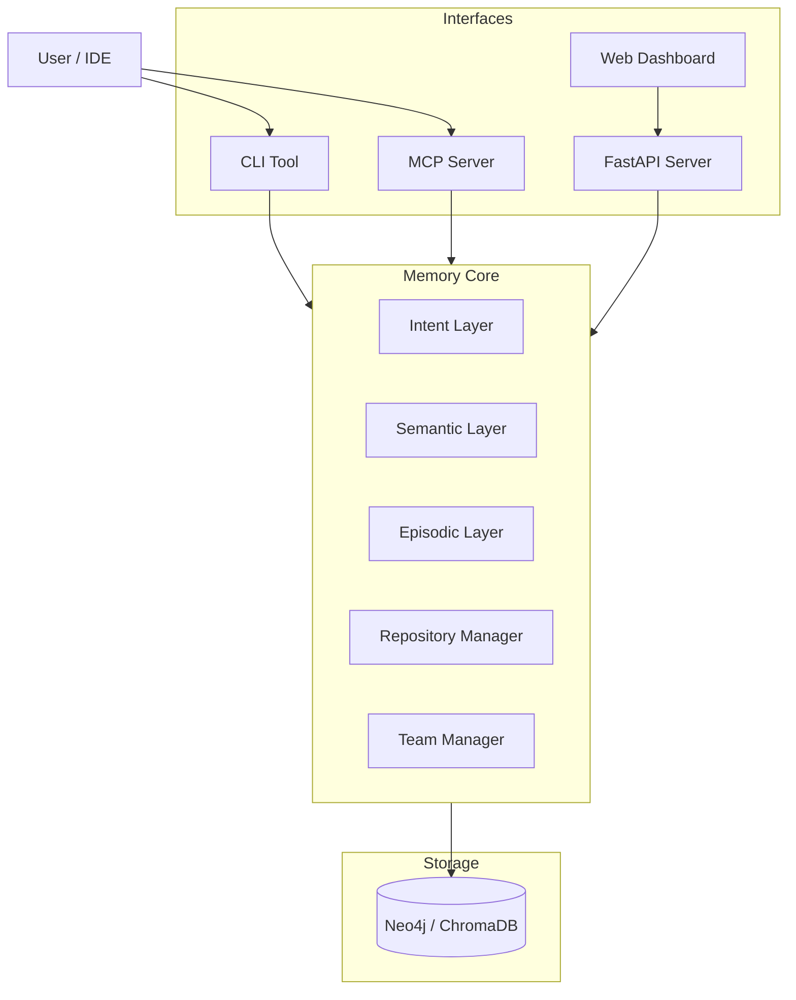

# LLM Memory

**Human-inspired memory system for LLMs** - persistent context, compressed knowledge, and intent tracking.

> **Vision**: A central, cross-functional memory that evolves with your team. Starting as a local tool for individuals, it will grow into a shared organizational brain that tracks context across multiple repositories.



---

## 📚 Documentation & Resources

| File | Description |
|------|-------------|
| [**docs/ROADMAP.md**](docs/ROADMAP.md) | Project vision and future phases |
| [**docs/deployment/PACKAGING.md**](docs/deployment/PACKAGING.md) | Detailed distribution guide (Docker, Standalone, Pip) |
| [**docs/deployment/AUTH.md**](docs/deployment/AUTH.md) | Server auth modes, env vars, and deployment notes |
| [**docs/deployment/RELEASE_CHECKLIST.md**](docs/deployment/RELEASE_CHECKLIST.md) | Repeatable pre-release and post-release checks |
| [**docs/deployment/RELEASING.md**](docs/deployment/RELEASING.md) | How to create releases |
| [**docs/development/ARCHITECTURE.md**](docs/development/ARCHITECTURE.md) | System architecture and core components |
| [**docs/development/MATURITY_PLAN.md**](docs/development/MATURITY_PLAN.md) | Path from developer preview to production candidate |
| [**docs/development/MEMORY_INTELLIGENCE_ROADMAP.md**](docs/development/MEMORY_INTELLIGENCE_ROADMAP.md) | Graph-informed roadmap for explainable, evidence-backed memory |
| [**docs/development/MCP.md**](docs/development/MCP.md) | MCP setup, tools, examples, and verification |
| [**docs/development/TESTING.md**](docs/development/TESTING.md) | Testing practices and guidelines |
| [**docs/development/STORAGE.md**](docs/development/STORAGE.md) | Storage backends comparison and configuration |
| [**scripts/evaluate_agent_ab.py**](scripts/evaluate_agent_ab.py) | Deterministic A/B benchmark for memory-assisted agent behavior |

---

## The Problem

Every time an LLM starts a session, it has to re-learn your project from scratch: files, patterns, past decisions, and goals. This **"Context Amnesia"** leads to repetitive explanations and lost knowledge.

## The Solution

LLM Memory creates a persistent cognitive layer that mimics human memory:

1.  **Episodic Memory** ("What happened"): Events, bugs fixed, decisions made.
2.  **Semantic Memory** ("What we know"): Patterns, rules, and warnings extracted from experience.
3.  **Intent Memory** ("Where we're going"): Current goals and constraints.

By injecting this pre-formed context, your LLM (Claude, ChatGPT, etc.) instantly understands *why* the code is written this way and *what* you're trying to achieve.

---

## 🚀 Capabilities

| Interface | Description | Key Features |
|-----------|-------------|--------------|
| **CLI** | Command Line Tool | `llm-memory record`, `recall`, `decision`, `warn` |
| **MCP Server** | Model Context Protocol | Exposes memory tools directly to Claude/IDE |
| **Dashboard** | Web Interface | Graph visualization, intent management, stats |
| **API** | REST API | Full programmatic access with JWT/API key auth |

### 🆕 Phase 3 Features

| Feature | Description |
|---------|-------------|
| **Multi-Repo Support** | Isolate memories by project, track dependencies |
| **Team Collaboration** | User/team management, shared context |
| **Cross-Repo Context** | Aggregate knowledge from dependent projects |
| **JWT Authentication** | Secure API access with tokens |

---

## 📦 Installation

Choose the method that fits your workflow.

### Method 1: Python Package (Recommended)

Install via pip. This includes the CLI, API server, and embedded dashboard. Add
`local-embeddings` when you want local sentence-transformer embeddings instead
of API/noop/fallback search.

```bash
# Lean server install: SQLite plus text fallback is the default
pip install llm-memory-mcp[api,mcp]

# Add ChromaDB only when persistent vector indexes are required
pip install llm-memory-mcp[api,mcp,chroma]

# Add local transformer/Torch support explicitly for non-production use
pip install llm-memory-mcp[api,mcp,local-embeddings]

# Local embedded graph backend without Docker/Neo4j
pip install "llm-memory-mcp[arcadedb,api,mcp]"

# From GitHub Release (direct download)
pip install https://github.com/djkeshawa/llm-memory/releases/download/v0.2.3/llm_memory_mcp-0.2.3-py3-none-any.whl
```

### Method 2: Docker

Run the API, dashboard, MCP-capable package, and storage with Docker Compose.
The `lite` profile uses SQLite and automatic embedding selection. The
`arcadedb` profile uses the embedded ArcadeDB graph backend in the app
container, with no separate database service. The `full` profile starts Neo4j
plus Ollama and pulls `nomic-embed-text`, so recall uses real semantic
embeddings out of the box.

```bash
# Quick local server + dashboard
docker compose --profile lite up --build

# Embedded local graph backend, no separate database service
docker compose --profile arcadedb up --build

# Full graph deployment with Neo4j included
docker compose --profile full up --build
```

Compose publishes API and database ports on `127.0.0.1` by default. Set a
unique `NEO4J_PASSWORD` for graph profiles and `LLM_MEMORY_SERVER_API_KEYS` for
dashboard access, then enter the API key in Dashboard Settings. Set
`LLM_MEMORY_BIND_HOST=0.0.0.0` only when remote exposure is intentional and
protected by TLS and network controls.

Open `http://localhost:8000/dashboard`. Set `LLM_MEMORY_EMBEDDING_PROVIDER`
to `openai` with `OPENAI_API_KEY` when you prefer hosted embeddings; automatic
selection prefers OpenAI when a key is present, otherwise the full profile uses
Ollama. Local sentence-transformer embeddings are intentionally optional because
they make the image much larger:

```bash
LLM_MEMORY_EXTRAS=api,mcp,neo4j,local-embeddings \
LLM_MEMORY_EMBEDDING_PROVIDER=sentence-transformers \
docker compose --profile full up --build
```

The default Docker image includes ArcadeDB Embedded but excludes ChromaDB and
local transformer/Torch dependencies. Override extras only for a deliberate
custom image:

```bash
LLM_MEMORY_EXTRAS=api,mcp,neo4j,openai,ollama \
docker compose --profile lite up --build
```

### Method 3: Standalone Executable

Updates for non-Python users. Download the latest release for your platform (Linux/macOS/Windows).

1.  Download from [Releases](https://github.com/djkeshawa/llm-memory/releases)
2.  Extract the archive
3.  Run `./llm-memory`

For detailed build and distribution instructions, see [docs/deployment/PACKAGING.md](docs/deployment/PACKAGING.md).

### Uninstall

```bash
# Remove the package
pip uninstall llm-memory

# Optionally remove data directory
rm -rf ~/.llm-memory
```

---

## ⚙️ Configuration

### Prerequisites

| Dependency | Version | Required | Installation |
|------------|---------|----------|--------------|
| **Python** | 3.10+ | Yes | [python.org](https://www.python.org/downloads/) |
| **ArcadeDB Embedded** | 26.4.x | Optional local graph backend | `pip install "llm-memory-mcp[arcadedb,api,mcp]"` |
| **Neo4j** | 5.15+ | For team/graph deployments | See below |
| **Node.js** | 18+ | For dashboard dev | [nodejs.org](https://nodejs.org/) |

### Storage Backends

SQLite is the default because it has the smallest local install. ArcadeDB is the
local-first embedded graph option. Neo4j remains the mature external graph
backend for shared/team deployments.

| Backend | Set `LLM_MEMORY_STORAGE_BACKEND` | Install | Requires separate service | Best for |
|---------|----------------------------------|---------|---------------------------|----------|
| SQLite | `sqlite` or unset | `llm-memory-mcp[api,mcp]` | No | Smallest local install |
| ArcadeDB | `arcadedb` | `llm-memory-mcp[arcadedb,api,mcp]` | No | Local embedded graph storage |
| Neo4j | `neo4j` | `llm-memory-mcp[neo4j,api,mcp]` | Yes | Shared/team graph deployment |

ArcadeDB stores structured graph data under
`$LLM_MEMORY_STORAGE_DATA_DIR/arcadedb` and keeps vector behavior conservative
for v1 by using the existing Chroma/text fallback path rather than native
ArcadeDB vector indexes.

```bash
# SQLite default
llm-memory init --type code

# ArcadeDB local graph backend
export LLM_MEMORY_STORAGE_BACKEND=arcadedb
llm-memory init --type code
llm-memory serve

# Equivalent one-shot server start
LLM_MEMORY_STORAGE_BACKEND=arcadedb llm-memory serve
```

### Neo4j Setup

LLM Memory defaults to local SQLite storage so you can start without external
services. Neo4j is required only when you choose the graph storage backend for
team/shared deployments. Choose one option:

**Option 1: Docker (Recommended)**
```bash
docker run -d \
  --name neo4j \
  -p 7474:7474 -p 7687:7687 \
  -e NEO4J_AUTH=neo4j/your-password \
  -v neo4j-data:/data \
  neo4j:5
```

**Option 2: Neo4j Desktop**
1. Download from [neo4j.com/download](https://neo4j.com/download/)
2. Create a new project and local DBMS
3. Start the database

**Option 3: Neo4j AuraDB (Cloud)**
1. Sign up at [neo4j.com/cloud/aura](https://neo4j.com/cloud/aura/)
2. Create a free instance
3. Copy the connection URI

### Environment Variables

Set these before running LLM Memory:

```bash
export LLM_MEMORY_STORAGE_BACKEND="sqlite"
export NEO4J_URI="bolt://localhost:7687"
export NEO4J_USER="neo4j"
export NEO4J_PASSWORD="your-password"
```

| Variable | Description | Default |
|----------|-------------|---------|
| `LLM_MEMORY_STORAGE_BACKEND` | Storage backend: `sqlite`, `arcadedb`, or `neo4j` | `sqlite` |
| `LLM_MEMORY_STORAGE_DATA_DIR` | Local storage root for SQLite/ArcadeDB files | `~/.llm-memory` |
| `NEO4J_URI` | Neo4j connection URI | `bolt://localhost:7687` |
| `NEO4J_USER` | Neo4j username | `neo4j` |
| `NEO4J_PASSWORD` | Neo4j password | **Required** |
| `LLM_MEMORY_REPO_ID` | Default project scope | *None* |
| `LLM_MEMORY_EMBEDDING_PROVIDER` | Embedding provider: `auto`, `sentence-transformers`, `openai`, `ollama`, `noop` | `auto` |
| `LLM_MEMORY_API_KEY` | API key for server auth | *None* |
| `LLM_MEMORY_JWT_TOKEN` | JWT token for client mode | *None* |
| `LLM_MEMORY_JWT_SECRET` | Secret for JWT signing (server) | *None* |

---

## ⚡ Quick Start

### 1. Initialize

Initialize LLM Memory in your project root:

```bash
llm-memory init --type code
```

### 2. Record Useful Memory

Start building your project's memory:

```bash
# Record a decision
llm-memory decision "Use JWT tokens" "Stateless scaling needed"

# Save a warning for specific files
llm-memory warn "src/auth.py" "Race condition possible - use mutex"

# Set a goal
llm-memory goal "Refactor Database Layer" --priority 2

# Search memories
llm-memory recall "authentication"
```

### 3. Start the Server & Dashboard

Launch the local server. The dashboard will be available at
`http://localhost:8000/dashboard`.

```bash
llm-memory serve
```

### 4. Give Context To An LLM

Generate a compact project context for pasting into an assistant:

```bash
llm-memory context
```

### 5. Measure Token Savings

See how many tokens your memory layer saves — auditable consolidation savings
(many episodic memories compressed into compact semantic knowledge) plus context
compactness (injected context vs. the full active store):

```bash
llm-memory tokens
llm-memory tokens --format json
```

### Migrate Between Backends

No automatic backend migration runs in v1. Use the existing export/import flow:

```bash
LLM_MEMORY_STORAGE_BACKEND=sqlite llm-memory export memory.json
LLM_MEMORY_STORAGE_BACKEND=arcadedb llm-memory import memory.json

# Or migrate into Neo4j after starting/configuring Neo4j
LLM_MEMORY_STORAGE_BACKEND=neo4j llm-memory import memory.json
```

---

## 🧪 Evaluate Agent Usefulness

LLM Memory includes deterministic evaluation scripts so you can measure whether
memory actually improves an agent workflow before wiring in a live model. These
benchmarks use isolated SQLite stores and noop embeddings by default, so they do
not require network access or API keys.

### Agent A/B Benchmark

Compare the same coding-agent tasks with memory disabled vs memory-grounded
context:

```bash
python3 scripts/evaluate_agent_ab.py
python3 scripts/evaluate_agent_ab.py --json
```

Example output:

```text
Agent memory A/B evaluation
Mode: deterministic_agent_proxy
Cases: 5

No memory:
  task_success_rate: 0%
  risky_action_rate: 100%

With memory:
  task_success_rate: 100%
  risky_action_rate: 0%
  citation_coverage_rate: 100%
  labelled_relevance_score: 100%

Risk reduction: 100% points (100% relative)
Token proxy delta: +25.4 mean words/case
Latency delta: +2.5 ms/case
```

Use this when you want a repeatable signal that project memory can surface
guardrails, cite relevant facts, abstain on unknown secrets, and avoid risky
agent actions. It is a deterministic proxy, not a full live-LLM coding benchmark.

### Grounding And Intelligence Checks

Run the companion evaluations for hallucination-risk reduction and graph/report
quality:

```bash
# Measures unsupported/false-answer reduction from memory grounding
python3 scripts/evaluate_hallucination.py --json

# Measures recall precision, evidence paths, stale intent surfacing, and report sections
python3 scripts/evaluate_memory_intelligence.py --json

# Measures storage/recall/import/export performance
python3 scripts/benchmark_memory.py --items 100 --json
python3 scripts/benchmark_memory.py --backend arcadedb --items 100 --json
```

For a stronger live-agent study, reuse the same case set with your model runner:
run each task once without memory context and once after calling `llm-memory
recall`, MCP `memory_before_change`, or `/ai/ask`; then score task success,
wrong edits avoided, citation coverage, token use, and latency.

---

## ⚡ Automatic Memory Injection (Claude Code)

Beyond MCP tools (which the agent must *choose* to call), LLM Memory can install
**real Claude Code hooks** so memory is injected automatically:

```bash
llm-memory hooks install claude-code
```

This merges two hooks into your project's `.claude/settings.json`:

| Hook | When | What it injects |
|------|------|-----------------|
| `SessionStart` | A session begins | Compact project memory: goals, constraints, warnings, conventions |
| `PreToolUse` (Read/Edit/Write) | Before the agent reads or edits a file | That file's warnings, past bugs, and decisions |

Properties: fail-open (a memory failure never breaks your session), no
permission interference (context only, never a permission decision), and no
repeat spam (each file's context is injected once per session). Requires
`llm-memory` on PATH. Remove with `llm-memory hooks uninstall claude-code`, or
pass `--no-auto-inject` to skip hook installation.

### Seed Memory From Your Existing Instruction Files

Import the context you already maintain (CLAUDE.md, AGENTS.md, `.cursorrules`,
`.cursor/rules/*.mdc`, copilot-instructions.md) as relevance-ranked memories:

```bash
llm-memory ingest-instructions            # idempotent; re-run after edits
llm-memory ingest-instructions --dry-run  # preview
```

---

## 🤖 MCP Server (Claude Desktop / IDEs)

LLM Memory implements the **Model Context Protocol (MCP)**, allowing AI assistants to directly read and write to your project's memory.

### Configuration

Add to your `claude_desktop_config.json`:

```json
{
  "mcpServers": {
    "llm-memory": {
      "command": "llm-memory-mcp",
      "args": []
    }
  }
}
```

### Available Tools
- `memory_recall`: Search past events and knowledge.
- `memory_record`: Save new findings or events.
- `memory_decision`: Document architectural choices.
- `memory_warn`: Flag fragile code areas.
- `memory_goal`: Manage project intent.
- `memory_file_context`: Get proactive context for specific files.
- `memory_session_start`: Start a Codex-style work session with project context.
- `memory_before_change`: Recall relevant warnings before editing files.
- `memory_after_work`: Record useful end-of-work memory.

### Tool Profiles (Token Efficiency)

Every advertised MCP tool definition costs context tokens in *every* session. Set
`LLM_MEMORY_MCP_PROFILE` to control how many tools are exposed:

| Profile | Tools | Use when |
|---------|-------|----------|
| `full` (default) | All tools | You want every advanced/maintenance tool available |
| `core` | The everyday recall-before-work / record-after-work loop | You want the leanest context footprint |

The `core` profile cuts tool-schema overhead by roughly 40% (~1,250 fewer tokens per
session in a typical setup). Hidden tools still work if a client calls them by name;
the profile only changes what is advertised.

```json
{
  "mcpServers": {
    "llm-memory": {
      "command": "llm-memory-mcp",
      "args": [],
      "env": { "LLM_MEMORY_MCP_PROFILE": "core" }
    }
  }
}
```

### Codex Workflow

Install the Codex integration after the Docker/API server is running:

```bash
llm-memory hooks install codex \
  --server-url http://127.0.0.1:8000 \
  --repo-id llm-memory
```

This writes project-level `AGENTS.md` workflow guidance and a managed MCP block
in `~/.codex/config.toml`. Restart Codex after installing. In each session,
use memory recall before changing code and record decisions, bug fixes, release
notes, and fragile areas after work.

---

## 🌐 Workspace Scope & Multi-Project Usage

LLM Memory is designed to **share knowledge across your entire workspace by default**, enabling cross-project learning.

### Default: Unified Workspace
All memories are stored in a shared graph. Memories created in Project A are accessible in Project B if relevant.

### Project Isolation
For completely separate contexts (e.g., client work), use the `--repo` flag or configuration:

```bash
# Initialize with specific scope
llm-memory init --repo client-xyz

# Or per-command
llm-memory record "Secret stuff" --repo secret-project
```

### Multi-Project Dependencies

Track how projects relate to each other. Use either the CLI or the REST API.

**Via CLI:**

```bash
# Register repositories
llm-memory repos register my-app --desc "Main application"
llm-memory repos register shared-lib --desc "Internal utilities"

# Declare a dependency
llm-memory repos dependency my-app shared-lib --type depends_on

# List repositories (optionally scoped to a team)
llm-memory repos list

# Get cross-repo context (warnings + breaking changes pulled from dependencies)
llm-memory repos context my-app
```

**Via REST API:**

```bash
# Register repositories
curl -X POST http://localhost:8000/repos -d '{"name": "my-app", "id": "app"}' -H "X-API-Key: key"
curl -X POST http://localhost:8000/repos -d '{"name": "shared-lib", "id": "lib"}' -H "X-API-Key: key"

# Add dependency
curl -X POST http://localhost:8000/repos/app/dependencies -d '{"target_repo_id": "lib"}' -H "X-API-Key: key"

# Get cross-repo context (includes warnings from lib)
curl http://localhost:8000/repos/app/context -H "X-API-Key: key"
```

### Teams

Group users and attribute memories to a team. Useful for shared-server deployments.

```bash
# Create a team and a user, then add the user to the team
llm-memory teams create "Platform"
llm-memory teams user alice --email alice@example.com
llm-memory teams add-member platform alice
```

The same operations are exposed under `/teams/*` on the REST API.

---

## 🛠️ Development

If you want to contribute or modify the dashboard:

```bash
# Clone repository
git clone https://github.com/djkeshawa/llm-memory.git
cd llm-memory

# Install in editable mode
make install-dev

# Build everything
make build

# Run tests
make test
```

---

## 🧠 Architecture



---

## License

MIT
