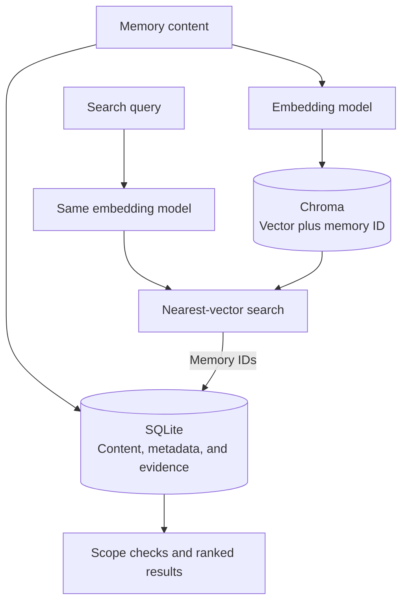
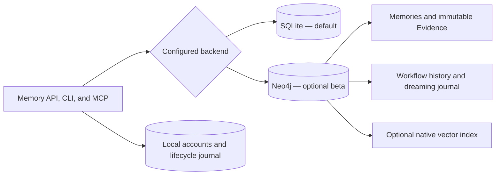

# Storage and embeddings

SQLite is the default store. Each project has a repository ID, and governed
retrieval stays within that scope. The configured data directory contains
`memories.db`, account and lifecycle databases when used, and optional local indexes.

## Local configuration

Run `visp-memory init` in your repository. A minimal `visp-memory.yaml` is:

```yaml
repo_id: my-project
storage:
  backend: sqlite
  data_dir: .visp-memory/data
embedding:
  provider: noop
```

Configuration discovery walks up from the current directory, checking
`visp-memory.yaml`, `visp-memory.json`, then `.visp-memory/config.yaml` at each
level. Relative storage paths resolve against the discovered configuration.
Environment overrides apply after loading the file.

| Setting | Purpose |
|---|---|
| `VISP_MEMORY_REPO_ID` | Project scope |
| `VISP_MEMORY_STORAGE_DATA_DIR` | Persistent data root; defaults to `.visp-memory/data` |
| `VISP_MEMORY_STORAGE_BACKEND` | `sqlite` (default), `arcadedb`, or `neo4j` |
| `VISP_MEMORY_EMBEDDING_PROVIDER` | `auto`, an explicit provider, or `noop`/`none` |
| `VISP_MEMORY_EMBEDDING_MODEL` | Model for the selected provider |
| `VISP_MEMORY_STORAGE_MODE` | `local`, `client`, or `server` |
| `VISP_MEMORY_STORAGE_SERVER_URL` | API endpoint in client mode |

Use [config.py](../../src/visp_memory/config.py) for the complete settings schema.
Missing project scope never grants a global read. Legacy unscoped records stay
quarantined for administrative inspection.

## How embeddings work

An embedding provider converts text into a numeric vector. With SQLite, Chroma
holds the optional vector index; SQLite retains the memory content and metadata.
At query time, the same compatible model embeds the query so similar vectors can
be retrieved. Returned records still pass scope checks and ranking.



This optional path needs **both a working provider and Chroma**. Without it,
keyword search remains available. An installed provider package or a configured
API key alone does not prove that vectors are indexed.

| Provider | Install/configure | Where text is processed |
|---|---|---|
| `noop` / `none` | No extra dependency | No embeddings; keyword search locally |
| `sentence-transformers` | `pip install "visp-memory[chroma,local-embeddings]"` | Local model; initial download may need network |
| `ollama` | `pip install "visp-memory[chroma,ollama]"`; set `OLLAMA_HOST` and model | Configured Ollama server |
| `openai` | `pip install "visp-memory[chroma,openai]"`; set `OPENAI_API_KEY` | Configured cloud endpoint |
| `openrouter` | `pip install "visp-memory[chroma,openai]"`; set `OPENROUTER_API_KEY` | Configured cloud endpoint |

Set provider and model explicitly for predictable behavior. `auto` chooses among
available providers and can fall back to keyword search. Cloud providers can
receive memory text and queries; see [provider boundaries](../TRUST.md#provider-boundaries).

Do not mix vectors from different models. Back up before changing providers or
models, then rebuild/reindex existing content for the chosen model. Settings in
the dashboard describe connection status; they do not themselves rebuild an index.
`visp-memory doctor` and the Operations page help distinguish fallback from semantic search.

Vector-wide `visp-memory dedup` requires real embeddings and a vector collection;
without them it reports an unavailable check. [Dreaming](DREAMING.md) can merge
eligible exact duplicates without either dependency.

## Backup and schema upgrades

For SQLite, stop the server **and all other writers**, then run:

```bash
visp-memory storage backup /backups/before-upgrade --data-dir /data --offline
visp-memory storage upgrade --data-dir /data --backup-dir /backups/schema-upgrade --offline
```

Use real paths appropriate to your installation. Each backup destination must be
new and outside the data root. `--offline` confirms writers are stopped; the command
does not stop them. Backups include SQLite databases, accounts, lifecycle/dreaming
history, and local indexes, with file hashes in a manifest. SQLite's backup API
includes committed WAL data; sidecars and nested `backups` directories are excluded.
Symbolic links are refused. Retain the matching configuration separately.

The upgrade command takes a full backup before migrating supported schemas 2, 3,
or 4 to schema 5. An already-current store is unchanged. A failed migration retains
the backup. Startup refuses older schemas that need migration and newer schemas
it cannot understand; it does not silently downgrade them.

For Docker, use a one-off container with the existing data volume and a separate
backup mount while the application is stopped. The paths above are paths **inside
that container**. Do not substitute an empty new data volume for the original.

### Restore

Keep writers stopped. Verify the backup manifest, copy the backed-up files into
a new empty data root, and test with the matching application version before
switching the server to it. Do not overlay a backup onto an active store.
Use native backup tools for shared database backends.

## Export and import

`visp-memory export memory.json` and `visp-memory import memory.json` move the
portable memory graph, not the complete server installation. Full backups also
preserve account and operational data that graph exports do not replace.

Format 2.0 includes evidence, memories, intents, and relationships. It validates
hashes and same-project references, and refuses malformed graphs or secret-bearing
legacy records. Each record kind has a 10,000-record export ceiling; overflow is
refused rather than truncated. See [export contracts](CONTRACT_SURFACE.md#export-and-import).

## Choose a backend

| Backend | Status and search | Graph export / atomic import |
|---|---|---|
| SQLite | Supported; keyword or optional Chroma | Yes / Yes |
| ArcadeDB | Frozen; embedded runtime, Chroma/text fallback | Yes / No |
| Neo4j | Opt-in beta; Evidence graph, native vectors or keyword search | Neo4j backup / empty-store restore; portable packs unavailable |
| Remote/HTTP | Uses the server's backend and access policy | No / No |

For remote access, keep the actual backend setting and select client mode:

```yaml
repo_id: my-project
storage:
  mode: client
  server_url: http://127.0.0.1:8000
```

The server owns embedding configuration in client mode. Configure client
credentials and project access through [authentication](../deployment/AUTH.md).
Use HTTPS beyond localhost. See [feature status](../FEATURE_STATUS.md) before
relying on team or cross-project features.

## Optional Neo4j backend

SQLite remains the default and the recommended choice for a local installation.
Choose Neo4j when you want to operate a separate graph database. The beta supports
capture, immutable Evidence citations, governed beliefs, recall, corrections,
external workflow completion, and scheduled dreaming. Retrieval never calls an LLM.

```yaml
storage:
  backend: neo4j
  allow_fallback: false
```

Install the `neo4j` extra and provide `NEO4J_URI`, `NEO4J_USER`, and
`NEO4J_PASSWORD` through your environment. Use `neo4j+s://` for a TLS-enabled
remote service. [Docker deployment](../deployment/PACKAGING.md#neo4j-beta) provides
an isolated database and authenticated application with persistent volumes.
The tested server is Neo4j 5.26 Community.



Memory creation commits the memory, captured Evidence, citation edges, and explicit
lineage together. Dreaming applies status changes and its undo journal in one database
transaction. Governed writes use a database lock to coordinate application workers;
this beta prioritizes consistency over parallel write throughput. Similarity links are
optional enrichment. A failed connection stops startup instead of switching databases.

### Backup, restore, and legacy migration

Stop application writers before these administrative operations. Keep the database
running. Commands use your normal `NEO4J_*` settings and never take a password argument:

```bash
python -m visp_memory.core.neo4j_admin backup /backups/memory-graph.json
python -m visp_memory.core.neo4j_admin restore /backups/memory-graph.json
```

Backup captures all graph nodes, relationships, vector properties, workflow history,
and dreaming journals. Files are created with owner-only access and existing files
are never overwritten. Restore requires an empty database and commits atomically.
Reopening the application validates Evidence hashes and citation scope. Back up the
application data directory separately: accounts, tokens, and the lifecycle operation
journal still live there. A graph backup alone is not a complete application backup.
This JSON backup loads the graph into memory; use Neo4j's offline database dump/load
for stores too large for that approach. It is distinct from portable memory packs,
which remain unavailable for Neo4j.

Populated legacy stores do not migrate implicitly at startup. For a marked Neo4j
schema 4 or 5 store, after stopping writers:

```bash
python -m visp_memory.core.neo4j_admin migrate /backups/before-neo4j-upgrade.json
```

The command writes a complete backup before changing data. IDs, creation times,
relationships, and intent history remain intact. Legacy content becomes an explicitly
unverified `legacy_snapshot`, with unknown provenance. Old prohibition labels become
hypotheses; migration cannot fabricate signed authority. Dangling or cross-project
lineage rolls back the migration and retains the backup. Older or unversioned databases
must first be exported using their original application version.

Changing `storage.backend` does not copy SQLite data. Keep the existing SQLite
installation and its backup when evaluating a fresh Neo4j store.
