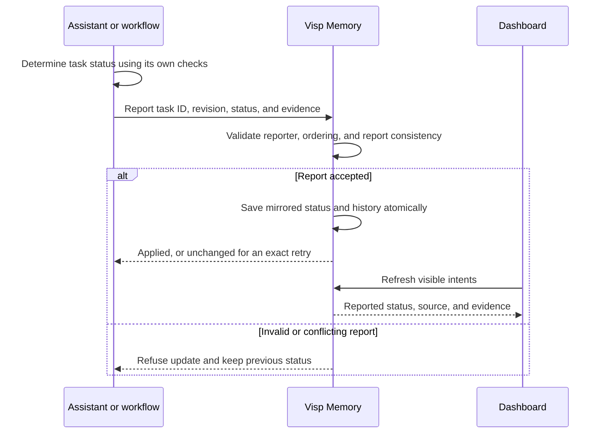

# Follow external intent completion

Visp Memory mirrors status explicitly reported by an assistant or external workflow.
It does not decide that work is complete from memory text, certify the supplied evidence,
or grant permission to release. This integration supports SQLite and Neo4j stores, including
remote clients connected to those servers. Other backends refuse reports explicitly.



## Connect your assistant or workflow

Create an intent and keep its returned ID alongside the external task ID. When your
workflow reports a status change, send the following JSON (for example, `report.json`):

```json
{
  "source": "coding-assistant",
  "task_id": "login-improvement",
  "event_id": "login-completed-1",
  "revision": 1,
  "status": "completed",
  "summary": "Login changes completed and checked",
  "checks": [{"description": "Login acceptance tests", "status": "passed"}],
  "evidence": [{"description": "Acceptance test run passed"}]
}
```

Evidence records may include an HTTP(S) `url` linking to a test run, commit, or review.
Do not include credentials. Completed reports require evidence and cannot include
failed or pending checks. These requirements check report consistency; Memory does
not execute or verify the checks itself.

Choose one transport:

- **MCP:** call `memory_update_intent` with `intent_id` and `workflow_report` containing
  the JSON above. Do not mix a report with ordinary description, priority, or status edits.
  Use the full tool profile if your selected profile does not expose this tool.
- **CLI:** `visp-memory intent report INTENT_ID --file report.json`.
- **REST:** POST that JSON to `/intents/INTENT_ID/workflow-status` using the intent owner's
  authenticated session or token (with `intent:write` and access to the project).
  An administrator can also establish the initial reporting connection.

The first accepted report binds the intent to its source, task ID, and authenticated
reporter. Keep that identity stable. Local CLI and stdio MCP share the `local-workflow`
identity. HTTP requests use the authenticated account; a different account cannot
replace its report, including an administrator.

Increment `revision` and use a new `event_id` for each change. An exact retry of the
latest report succeeds without adding another history entry. Stale/conflicting revisions
and reused event IDs are refused. A newer `active` report reopens the intent; `closed`
reports mirror closure. A REST conflict returns HTTP 409.

The dashboard refreshes visible intents every 15 seconds and when its window regains
focus. It displays the reported status, source, checks, evidence, and recent history.
Generic `complete`, `done`, and `status` inputs still record advisory outcomes only.
Completion evaluation remains a suggestion and never changes status. The external
assistant must send reports; installing this feature does not automatically connect
other applications or watch their conversations.
