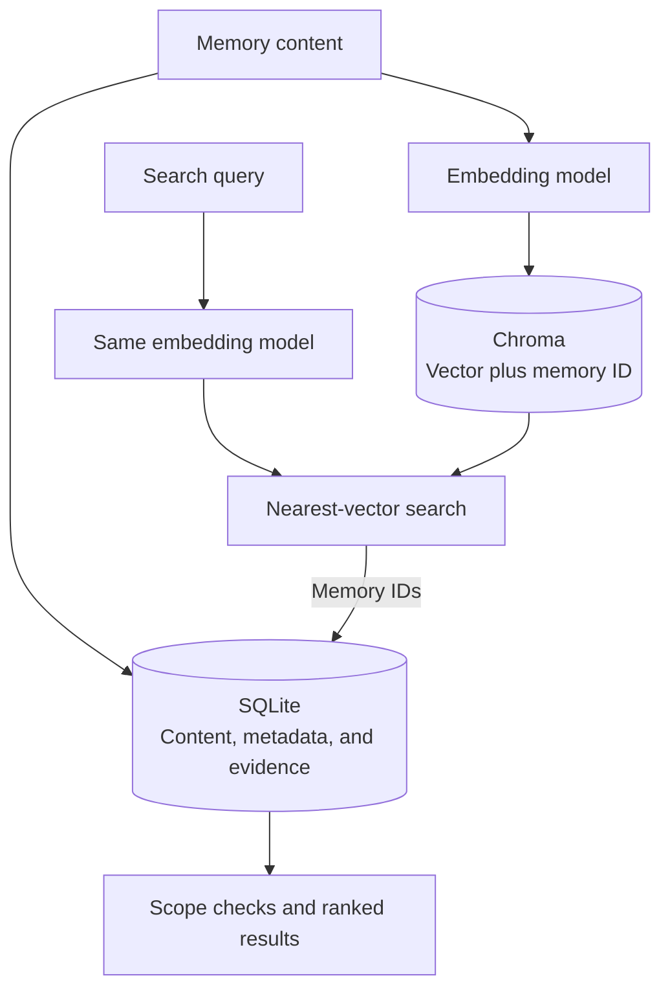
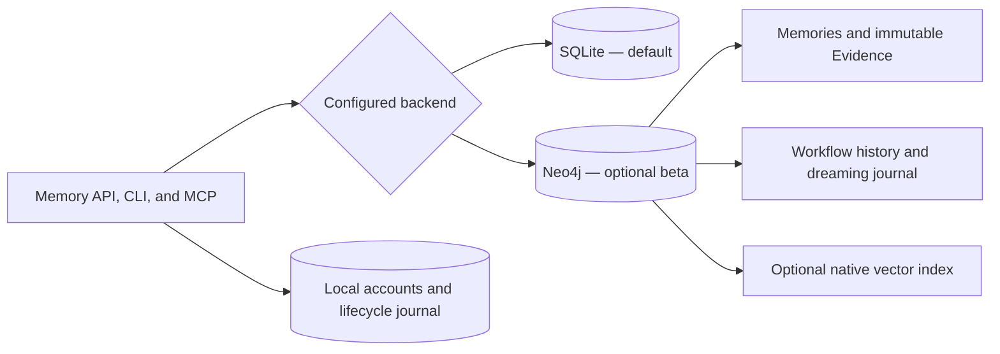

# Storage and embeddings

For a local server shared by project clients, see the [shared server guide](SHARED_SERVER.md).

SQLite is the default store. Each project has a repository ID, and governed
retrieval stays within that scope. The configured data directory contains
`memories.db`, account and lifecycle databases when used, and optional local indexes.

## Local configuration

Run `visp-memory init` in your repository. A minimal `visp-memory.yaml` is:

```yaml
repo_id: my-project
storage:
  backend: sqlite
  data_dir: .visp-memory/data
embedding:
  provider: noop
```

Configuration discovery walks up from the current directory, checking
`visp-memory.yaml`, `visp-memory.json`, then `.visp-memory/config.yaml` at each
level. Relative storage paths resolve against the discovered configuration.
Environment overrides apply after loading the file.

| Setting | Purpose |
|---|---|
| `VISP_MEMORY_REPO_ID` | Project scope |
| `VISP_MEMORY_STORAGE_DATA_DIR` | Persistent data root; defaults to `.visp-memory/data` |
| `VISP_MEMORY_STORAGE_BACKEND` | `sqlite` (default), `arcadedb`, or `neo4j` |
| `VISP_MEMORY_EMBEDDING_PROVIDER` | `auto`, an explicit provider, or `noop`/`none` |
| `VISP_MEMORY_EMBEDDING_MODEL` | Model for the selected provider |
| `VISP_MEMORY_STORAGE_MODE` | `local`, `client`, or `server` |
| `VISP_MEMORY_STORAGE_SERVER_URL` | API endpoint in client mode |

Two variables are read directly rather than applied as overrides on the loaded
file. `VISP_MEMORY_CONFIG` names an explicit config file, skipping the directory
walk above; startup fails if that file does not exist (`visp-memory serve
--shared` sets it). `VISP_MEMORY_STORAGE_WRITER_GUARD=off` disables the process
guard described below (unsafe). Server-mode switches
(`VISP_MEMORY_SERVER_SHARED`, `VISP_MEMORY_SERVER_LOCAL_OWNER_MODE`) are listed
in the [shared server guide](SHARED_SERVER.md#environment-variables).

Use [config.py](../../src/visp_memory/config.py) for the complete settings schema.
Missing project scope never grants a global read. Legacy unscoped records stay
quarantined for administrative inspection.

## Connect a project to a shared server

For a store shared by agents, run one shared server and connect each project to
it. The server must already be running; otherwise `connect` fails with a hint to
start it.

```bash
visp-memory serve --shared
cd /path/to/project
visp-memory connect
```

Without `--server-url`, `connect` looks for a discovery record at
`~/.visp-memory/run/server-<port>.json`. It takes the newest by modification
time whose process ID is alive and whose URL answers `GET /` with a status below
500. Discovered URLs must be HTTP(S) loopback origins; redirects are not followed
by the discovery probe. It otherwise falls back to `http://127.0.0.1:8000`.
Only a server in
[open local-owner mode](AUTHENTICATION.md#open-local-owner-mode) writes a record,
so for a server with credentials pass `--server-url` (or accept the fallback).
API key and JWT credentials are withheld from an automatically discovered URL
unless it matches `storage.server_url` (including its environment override).

The repository ID is, in order: `--repo`, then `repo_id` in the active
project config, then the project root's directory name. Config selection uses
the same discovery order as normal startup (including `VISP_MEMORY_CONFIG`).
The project root is the discovered config's project base; failing that, the Git
top-level directory; failing that, the current directory.

`connect` updates that active config with `repo_id`, `storage.mode: client`, and
`storage.server_url`, preserving unrelated settings. It creates `visp-memory.yaml`
only when no config exists; JSON and `.visp-memory/config.yaml` are updated in
place. Simple block YAML retains comments and unrelated text. Complex YAML is
rewritten after saving a `.backup` copy (numbered if a backup already exists),
and the command reports that comments were not kept. It then registers the
repository on the server.
Repository IDs may contain `/` (for example,
`org/project`); REST clients URL-encode IDs, and repository suffix routes such as
`/export`, `/import`, and `/registration` accept decoded slashes.

In client mode, `visp-memory doctor` reads repository registration and intent usage
for the configured `repo_id` from the server. It requires `project:read` and
`intent:read` with a personal access token. Missing scope, unavailable diagnostic
routes on older servers, and server errors are reported as unreadable checks.
The checks do not create a local store. On older servers, clients fall back to a
normal memory read when `/peek` is unavailable (which may increment access counts),
omit turn-key hits when that route is unavailable, and retry legacy capability
probes so upgrades become visible.

To copy records from the project's previous local store, add
`--migrate-local`. The import goes through the server and the old data directory
is retained. The command refuses if any local records belong to a different
repository ID, names the source and target IDs, and leaves the config unchanged.
Use `--repo <original-id>` for a store belonging to that repository; export/import
repositories separately for a store containing multiple scopes. Never point
migration at the shared server's own data directory.

Before importing, the command prints the source directory and record counts by
original provenance tier. Migration replaces every memory's `provenance:*` tags
and source with the import channel's `external` tier, clears `approved_by` and
`approved_at`, and sets Evidence provenance to `external`. Memory and Evidence
metadata record `write_channel: import`; existing attribution is retained. This
happens on the client before sending, only for `--migrate-local`; other file and
server imports keep their existing behavior. No `--yes` is required.

Content, scope, Evidence hashes and lineage remain unchanged, so signed authority
attestations still verify and are retained. The server continues validating hashes,
signatures and scope. Evidence uses its own provenance field; intents and graph
links have no memory provenance tier and are counted as unknown. The result
distinguishes new records from IDs already present in the server's pre-import
export, including on reruns.

External records are available to explicit recall but are never auto-injected.
After owner review, re-approve a memory with `PATCH /memories/{id}`: replace its
`provenance:*` tags with `provenance:authored` (preserve its other tags) and set
`source` to `authored`. For a memory with no other tags, the JSON body is
`{"tags": ["provenance:authored"], "source": "authored"}`. Use the configured
server's normal authentication and repository scope. Evidence remains immutable.
`visp-memory review accept` changes proposal status, not provenance.

Agent setup can be included in the same command. `--agent-config` is a
repeatable option:

```bash
visp-memory connect --agent-config codex --agent-config claude-code
```

The resulting client configuration is what each agent reads from the project.
While the server holds a SQLite or ArcadeDB data directory, other processes
cannot open that directory in local mode. A server also refuses to start while
local writers are active. Multiple local-mode processes may still coexist for
existing stdio MCP and hook workflows; this does not make the vector indexes
safe for concurrent writes. Neo4j and HTTP clients do not take a local store guard.

In client mode, `visp-memory storage backup` and `storage upgrade` do not go
through the server: stop the server and pass both `--offline` and
`--data-dir <server data dir>`.

The guard uses OS locks in `<data_dir>/.locks`, released on exit or crash.
`server.json` records the holder's PID, URL, and start time for diagnostics only;
it does not determine whether a process is alive. Do not delete active lock files.
If the filesystem prevents creating or locking these files, a warning is logged
and startup continues without protection. `VISP_MEMORY_STORAGE_WRITER_GUARD=off`
also disables the guard and is unsafe for a store shared with a server.

Library code should close a `Memory` (`memory.close()` or `with Memory(...)`)
before deleting its data directory: on Windows an open lock file cannot be
removed.

## How embeddings work

An embedding provider converts text into a numeric vector. With SQLite, Chroma
holds the optional vector index; SQLite retains the memory content and metadata.
At query time, the same compatible model embeds the query so similar vectors can
be retrieved. Returned records still pass scope checks and ranking.



This optional path needs **both a working provider and Chroma**. Without it,
keyword search remains available. An installed provider package or a configured
API key alone does not prove that vectors are indexed.

| Provider | Install/configure | Where text is processed |
|---|---|---|
| `noop` / `none` | No extra dependency | No embeddings; keyword search locally |
| `sentence-transformers` | `pip install "visp-memory[chroma,local-embeddings]"` | Local model; initial download may need network |
| `ollama` | `pip install "visp-memory[chroma,ollama]"`; set `OLLAMA_HOST` and model | Configured Ollama server |
| `openai` | `pip install "visp-memory[chroma,openai]"`; set `OPENAI_API_KEY` | Configured cloud endpoint |
| `openrouter` | `pip install "visp-memory[chroma,openai]"`; set `OPENROUTER_API_KEY` | Configured cloud endpoint |

Set provider and model explicitly for predictable behavior. `auto` chooses among
available providers and can fall back to keyword search. Cloud providers can
receive memory text and queries; see [provider boundaries](../reference/TRUST.md#provider-boundaries).

Do not mix vectors from different models. Back up before changing providers or
models, then rebuild the index for existing content. Changing the provider setting
does not rebuild anything by itself: use **Settings → embedding diagnostics** in the
dashboard to preview and run the rebuild, then confirm the scoped records are indexed
before relying on paraphrase recall.
`visp-memory doctor` and the Operations page help distinguish fallback from semantic search.

With `nomic-embed-text`, documents are embedded with the `search_document:` prefix
and queries with `search_query:`. These vectors live in a separate versioned space
(`nomic_search_v1`), so they are never mixed with older unprefixed vectors, which
are retained but not queried. After upgrading an existing Nomic store, rebuild the
index explicitly; startup never regenerates vectors. Other providers use
dimension-based spaces, so changing model still requires the backup and rebuild
procedure above.

On Neo4j, `noop` uses keyword search and does not create a new vector index.
It cannot use constant vectors to make unrelated memories look semantically similar.

### Turn keys (experimental)

A conversation memory's single embedding is dominated by what most of its turns
discuss, so a fact mentioned once in passing can be hard to retrieve. Turn keys
also embed each substantive user turn separately, pointing back to the memory and
the exact span of that turn. Coverage briefs (`context_selection="coverage"`) then
add up to thirty best-matching turns as cited passages. Each passes the same scope,
time and trust checks as any other candidate.

```yaml
embedding:
  turn_keys: true   # or VISP_MEMORY_EMBEDDING_TURN_KEYS=true
```

Turn keys need a real embedding provider and cost one embedding per user turn at
write time. They live in a separate index (a Chroma collection on SQLite,
`:MemoryKey` nodes on Neo4j), so memory-level search is unchanged. Keys are
removed with their memory or repository. Existing memories gain keys when you run
the explicit index rebuild.

Vector-wide `visp-memory dedup` requires real embeddings and a vector collection;
without them it reports an unavailable check. [Dreaming](DREAMING.md) can merge
eligible exact duplicates without either dependency.

## Backup and schema upgrades

For SQLite, stop the server **and all other writers**, then run:

```bash
visp-memory storage backup /backups/before-upgrade --data-dir /data --offline
visp-memory storage upgrade --data-dir /data --backup-dir /backups/schema-upgrade --offline
```

Use real paths appropriate to your installation. Each backup destination must be
new and outside the data root. `--offline` acknowledges that writers are stopped;
the command also holds the server guard for the whole operation and refuses a
live server or local writer in another process. It does not stop them.
Backups include SQLite databases, accounts, lifecycle/dreaming
history, and local indexes, with file hashes in a manifest. SQLite's backup API
includes committed WAL data; sidecars, `.locks`, and nested `backups` directories are excluded.
Symbolic links are refused. Retain the matching configuration separately.

The upgrade command takes a full backup before migrating supported schemas 2, 3,
or 4 to schema 5. An already-current store is unchanged. A failed migration retains
the backup. Startup refuses older schemas that need migration and newer schemas
it cannot understand; it does not silently downgrade them.

For Docker, use a one-off container with the existing data volume and a separate
backup mount while the application is stopped. The paths above are paths **inside
that container**. Do not substitute an empty new data volume for the original.

### Restore

Keep writers stopped. Verify the backup manifest, copy the backed-up files into
a new empty data root, and test with the matching application version before
switching the server to it. Do not overlay a backup onto an active store.
Use native backup tools for shared database backends.

## Export and import

`visp-memory export memory.json` and `visp-memory import memory.json` move the
portable memory graph, not the complete server installation. Full backups also
preserve account and operational data that graph exports do not replace.

Exports contain Evidence, memories, intents, and relationships, with a 10,000-record
ceiling per record kind; overflow is refused rather than truncated. Which backends can
export and import, and what import validates, are in the
[export contract](../reference/CONTRACTS.md#export-and-import). REST imports default
to a 64 MiB body limit; configure `server.max_import_body_bytes` or
`VISP_MEMORY_SERVER_MAX_IMPORT_BODY_BYTES` to change it. Oversized bodies return
HTTP 413 before parsing.

## Choose a backend

| Backend | Status and search | Backup and portability |
|---|---|---|
| SQLite | Supported; keyword or optional Chroma | Portable export and import |
| ArcadeDB | Frozen; embedded runtime, keyword search only | Export only |
| Neo4j | Opt-in beta; Evidence graph, native vectors or keyword search | [Native backup and restore](#backup-restore-and-legacy-migration); no portable export |
| Remote/HTTP | Uses the server's backend and access policy | Through the server |

For remote access, keep the actual backend setting and select client mode:

```yaml
repo_id: my-project
storage:
  mode: client
  server_url: http://127.0.0.1:8000
```

The server owns embedding configuration in client mode. Configure client
credentials and project access through [authentication](AUTHENTICATION.md).
Use HTTPS beyond localhost. See [feature status](../reference/FEATURE_STATUS.md) before
relying on team or cross-project features.

## Optional Neo4j backend

SQLite remains the default and the recommended choice for a local installation.
Choose Neo4j when you want to operate a separate graph database. The beta supports
capture, immutable Evidence citations, governed beliefs, recall, corrections,
external workflow completion, and scheduled dreaming. Retrieval never calls an LLM.

Recall feedback works as on SQLite: explicit use reinforces a memory, while
inspection and mere exposure do not. Raw queries are stored hashed. Feedback
survives graph backup and restore and is removed with its memory.

```yaml
storage:
  backend: neo4j
  allow_fallback: false
```

Install the `neo4j` extra and provide `NEO4J_URI`, `NEO4J_USER`, and
`NEO4J_PASSWORD` through your environment. Use `neo4j+s://` for a TLS-enabled
remote service. [Docker deployment](INSTALLATION.md#neo4j-beta) provides
an isolated database and authenticated application with persistent volumes.
The tested server is Neo4j 5.26 Community.



Memory creation commits the memory, captured Evidence, citation edges, and explicit
lineage together. Dreaming applies status changes and its undo journal in one database
transaction. Governed writes use a database lock to coordinate application workers;
this beta prioritizes consistency over parallel write throughput. Similarity links are
optional enrichment. A failed connection stops startup instead of switching databases.

### Backup, restore, and legacy migration

Stop application writers before these administrative operations. Keep the database
running. Commands use your normal `NEO4J_*` settings and never take a password argument:

```bash
python -m visp_memory.core.neo4j_admin backup /backups/memory-graph.json
python -m visp_memory.core.neo4j_admin restore /backups/memory-graph.json
```

Backup captures all graph nodes, relationships, vector properties, workflow history,
and dreaming journals. Files are created with owner-only access and existing files
are never overwritten. Restore requires an empty database and commits atomically.
Reopening the application validates Evidence hashes and citation scope. Back up the
application data directory separately: accounts, tokens, and the lifecycle operation
journal still live there. A graph backup alone is not a complete application backup.
This JSON backup loads the graph into memory; use Neo4j's offline database dump/load
for stores too large for that approach. It is distinct from portable memory packs,
which remain unavailable for Neo4j.

Populated legacy stores do not migrate implicitly at startup. For a marked Neo4j
schema 4 or 5 store, after stopping writers:

```bash
python -m visp_memory.core.neo4j_admin migrate /backups/before-neo4j-upgrade.json
```

The command writes a complete backup before changing data. IDs, creation times,
relationships, and intent history remain intact. Legacy content becomes an explicitly
unverified `legacy_snapshot`, with unknown provenance. Old prohibition labels become
hypotheses; migration cannot fabricate signed authority. Dangling or cross-project
lineage rolls back the migration and retains the backup. Older or unversioned databases
must first be exported using their original application version.

Changing `storage.backend` does not copy SQLite data. Keep the existing SQLite
installation and its backup when evaluating a fresh Neo4j store.
