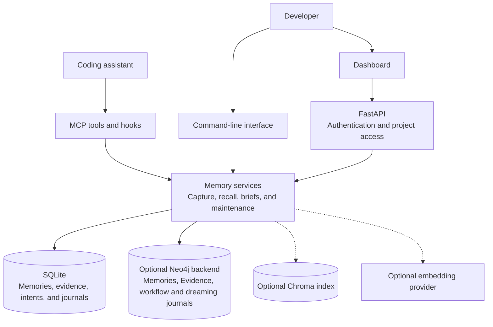
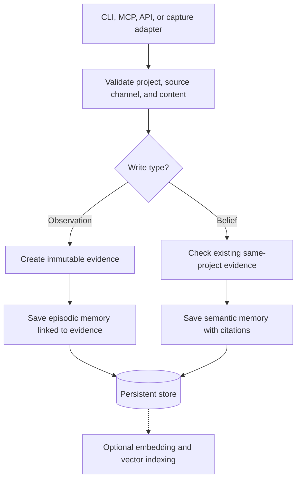
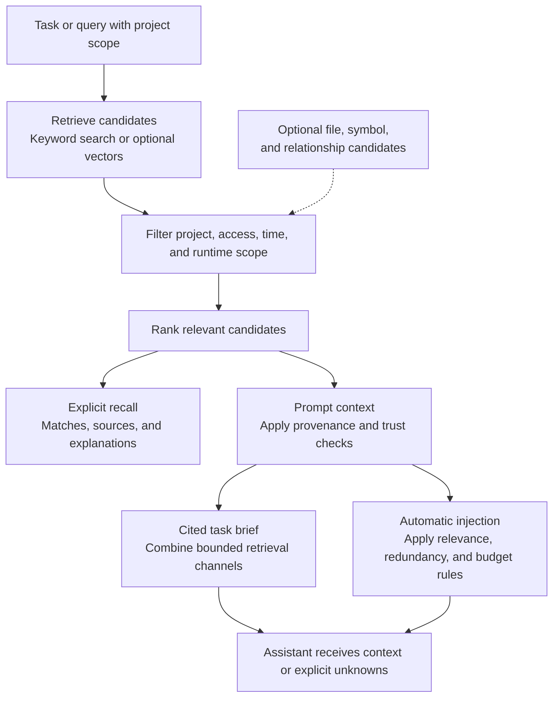

# Architecture and data flow

Visp Memory is a storage and retrieval service for project knowledge. A coding
assistant calls it for context, then decides and executes the work itself.
The default deployment uses SQLite; the dashboard is a static Next.js application
served by the same FastAPI process as the API.

## Components

Local CLI and stdio MCP use project configuration directly. Remote clients call
an authenticated server, which owns storage and provider configuration. Neo4j is
an opt-in beta alternative to SQLite, with native vectors.
[Backend limits and backup requirements](../guides/STORAGE.md#choose-a-backend) are explicit.

## What is stored

| Record | Purpose | Example |
|---|---|---|
| Evidence | Immutable source content with provenance and a content hash | A captured test result or original observation |
| Episodic memory | Something that happened in the project | A migration failed because an index was missing |
| Semantic memory | Reusable knowledge citing evidence | The migration requires that index |
| Intent | A goal, constraint, or direction, with reported outcome history | Add retry handling without changing the public API |
| Relationship | A link between records or code references | A later note supersedes an older decision |

Evidence and conclusions remain separate. Corrections create new source records;
missing or cross-project citations cause a semantic write to be refused.
See [storage contracts](CONTRACTS.md#evidence-and-belief-storage-contract).

## Capture and write

Adapters assign provenance from the write channel; a payload cannot grant itself
a trusted tier. Known secret patterns are redacted on normal capture. Imports
that would need rewriting are refused to preserve their content hashes.
[Trust and privacy](TRUST.md) explains the boundary and its limits.

Explicit conversation capture records the redacted original source before learning
from bounded chunks. Model output must identify a source, speaker and complete
verbatim quotation; claim fields must occur in that quotation. This conservative
extractive check may reject useful paraphrases. Rejected output records a failure
and leaves the original source available. Attributed facts cite their source
episodes, including surrounding context; an assistant suggestion does not become
an active user goal. Checkpoints resume completed source writes and validated items
by content identity. A dry run runs extraction but writes no memories or manifest.
Capture requires an explicitly configured host model and does not run in retrieval.

## Search and task context

Explicit search and automatic prompt injection have different purposes. Search
lets a user inspect candidates, including quarantined records within their scope.
Task briefs and automatic prompt context apply additional trust and budget checks;
the lower-level context compiler is an
[inspection surface](TRUST.md#provenance-and-quarantine).

This is a conceptual view of several retrieval surfaces, not a claim that every
endpoint runs an identical pipeline. Task briefs combine search, file/symbol,
and relationship signals; the machine recall contract can add structurally
related memories without displacing direct matches. Scores rank results; they
are not probabilities of correctness. The retrieval policy never calls an LLM.

### Ranking strategies

Every surface that ranks memories accepts a `ranking_strategy`. All strategies
apply the same scope, eligibility, trust, and relevance checks; they only change
how eligible candidates are found and ordered.

| Strategy | Candidates | Ordering | Backends |
|---|---|---|---|
| `default` | Canonical search (keyword, or vectors when configured) | Canonical relevance | All |
| `hybrid` | Canonical pool of at least 100 eligible candidates | Equal-weight reciprocal-rank fusion of canonical and BM25 ranks | All |
| `hybrid_union` (experimental) | Separate bounded vector and keyword pools, deduplicated | Same fusion as `hybrid` | SQLite, Neo4j; others refuse it |

BM25 statistics come from the eligible candidate pool, not a full-corpus index, so
fusion cannot recover a record absent from that pool. Results keep their canonical
`relevance_score` and expose `hybrid_rank_score` and `hybrid_ranks` separately;
fusion orders results but does not replace the relevance floor.

In task briefs and graph context, the chosen strategy orders direct evidence before
graph seeds are chosen. Graph, file, and symbol channels still contribute, and
structural-only admissions cannot become graph seeds. The strategy is available on
Python recall, `visp-memory recall` and `brief` (`--ranking-strategy`), the
`memory_recall`, `memory_prepare_task`, and `memory_context` MCP tools, and the
`POST /context/brief` and `POST /context/compile` endpoints.

### Context selection

Context compilation and task briefs accept `context_selection`:

- `default` packs whole memories in rank order.
- `coverage` (experimental) selects verbatim passages with source offsets. Short
  conversation turns stay intact; long turns offer bounded sentence windows, with a
  bounded preceding turn so an answer keeps its question and qualifiers. Overlapping
  passages from one source merge under one citation. Half the evidence budget is
  reserved for direct matches before remaining capacity is shared, and passages are
  chosen by query-term coverage, relevance, and incremental token cost.

With [turn keys](../guides/STORAGE.md#turn-keys-experimental) enabled, coverage briefs
also add individually matched conversation turns as cited passages, ranked as equals
of the existing candidates rather than automatic winners.

Use `brief --context-selection coverage`, or the `context_selection` field on
`memory_prepare_task`, query-based `memory_context`, and the HTTP context endpoints.

### Injection policy

Automatic injection can return nothing when there is no useful signal. Defaults
from [the implementation](../../src/visp_memory/core/injection.py) are:

| Control | Default |
|---|---|
| Task specificity | At least 3 meaningful terms, unless a file is supplied |
| Small store | Below 5 memories, consider warnings only |
| Relevance floor | 0.55 |
| Distinction from weak matches | Margin 0.04, unless relevance reaches 0.68 |
| Output budget | At most 4 memories and 1,200 characters |
| Near-duplicate filter | Term overlap threshold 0.7 |

Hooks can use smaller budgets. Preview the actual selection and available
rejection counts with `visp-memory preview "fix session expiry" --file src/auth.py`.
Evaluate threshold changes against the [selection benchmarks](BENCHMARK.md).

## Maintenance and progress

[Dreaming](../guides/DREAMING.md) runs bounded, project-scoped cleanup in the server. It
merges eligible exact duplicates reversibly and leaves broader consolidation
and expiry proposals for review. It does not call a model or modify intent status.

[Workflow reports](../guides/WORKFLOW_REPORTS.md) mirror explicit status from the assistant
or external workflow that owns a task. Ordered reports, reporter identity, and
history prevent stale updates from replacing newer ones. Memory checks report
consistency; it does not verify the underlying work.

## Code map

Paths are relative to `src/visp_memory/`.

| Location | Responsibility |
|---|---|
| `interfaces/`, `hooks/`, `capture/` | CLI, MCP, host integration, and capture adapters |
| `server/` | HTTP access controls, API routes, and dashboard hosting |
| `core/memory.py`, `layers/` | Memory facade and record-specific operations |
| `core/storage.py`, `core/remote_storage.py` | SQLite storage and remote delegation |
| `core/eligibility.py`, `core/ranking.py`, `core/trust.py` | Eligibility, ranking, and prompt trust |
| `core/injection.py`, `core/task_brief.py` | Budgeted injection and cited context |
| `core/embeddings.py` | Provider selection and embedding generation |
| `core/dreaming/`, `core/intent_workflow.py` | Cleanup journals and external progress reports |

For exact API guarantees, use the [contracts reference](CONTRACTS.md).
For changes, follow [Contributing](../../CONTRIBUTING.md) and [testing](../development/TESTING.md).
